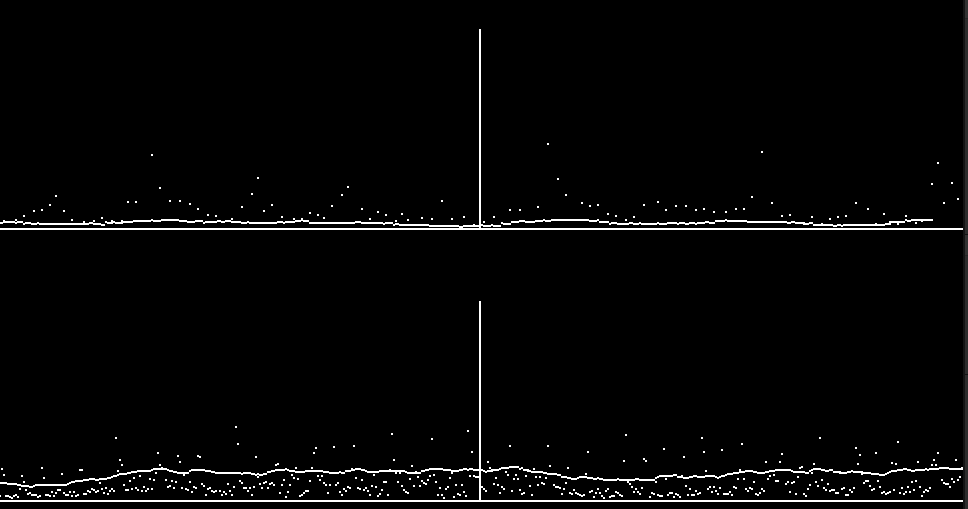

+++
title = "Unity中的音频分析算法：预处理音频分析"
date = "2022-03-21 18:10:00 +0800"
tags = ["Game Design", "technology"]
categories = ["technology"]
slug = "audio-analysis-algorithms-in-unity-preprocessing-audio-analysis"
indent = false
dropCap = false
# katex = true
+++

> 在进行实时分析时，我们发现我们必须稍微滞后于当前播放的音频才能检测节拍。我们也只能使用在音频中直到当前时间检测到的频谱数据来做计算，这些限制让我们的音频分析变得很受制约。不过我们可以先对音频进行预处理来解决这些限制。


## 本系列文章

[**Unity中的音频分析算法：介绍**](/tech/beat_tracking_in_unity_introduction)

[**Unity中的音频分析算法：使用 Unity API 进行实时音频分析**](/tech/audio-analysis-algorithms-in-unity-real-time-audio-analysis/)

[**Unity中的音频分析算法：预处理音频分析**](/tech/audio-analysis-algorithms-in-unity-preprocessing-audio-analysis)

<!-- [演示视频链接：https://www.bilibili.com/video/BV1zY4y1h7DL/](https://www.bilibili.com/video/BV1zY4y1h7DL/) -->


---

在进行实时分析时，我们发现我们必须稍微滞后于当前播放的音频才能检测节拍。我们也只能使用在音频中直到当前时间检测到的频谱数据来做计算，这些限制让我们的音频分析变得很受制约。不过我们可以先对音频进行预处理来解决这些限制。

如果你还没有阅读本系列的上一篇文章，使用 Unity API 进行实时音频分析，请在继续阅读之前一定花时间搞懂，它涵盖了本篇预处理分析所需的许多核心概念。~~**好了，先占个坑，开始找工作了，有时间就更新。**~~


在进行实时分析时，我们不可能在播放音频时瞬间检测出节拍，因此我们必须稍微落后于当前播放音频的进度来检测节拍。 我们一边播放音频一边进行节拍检测是一个限制因素，不过，我们可以通过预先处理整个音频文件来消除这些限制。

## Unity 函数

虽然 Unity 提供的的大多数函数都是用于实时分析，但它确实也给我们造好了轮子。 要预先处理整个音频文件，我们需要该文件的所有样本数据。 Unity 允许我们使用 **AudioClip.GetData** 获取该数据。它将音频的采样数据放到了指定的数组里。

```csharp
AudioSource aud = GetComponent<AudioSource>();
float[] samples = new float[aud.clip.samples * aud.clip.channels];
aud.clip.GetData(samples, 0);
```


**AudioClip.samples** 是音频中包含的单通道或组合通道样本的总数。 举例来说，如果一个音频有 100 个立体声样本，**AudioClip.samples** 将为 50。我们乘以 **AudioClip.channels**，因为 **AudioClip.GetData** 将以交错的格式返回样本数据。 比如我们有一个立体声音频，数据将返回为： 

L = 左声道 ; R = 右声道  
[L, R, L, R, L, R,…]  


这会给计算带来很大的计算量，如果我们想要类似于 Channel 0 在 **AudioSource.GetOutputData** 中返回的数据，我们需要遍历整个音频的采样数组并将每两个样本平均以获得单声道样本。 这对于没有环绕音效或者是声道单一的音频来说是不必要的资源浪费。让我们来大致算一下我们是否要权衡一下计算量和检测效果带来的利弊。

如果我有一个 5 分钟（300 秒）的音轨，采样率为每秒 48000 个样本，这意味着我们有：
300 * 48000 = 14,400,000 个样本（这些样本都在被赋值给了 **AudioClip.samples**）
但是，如果我们在立体声中，我们有交错的样本，这使我们的样本数加倍
14,400,000 * 2 = 28,800,000 个样本
如果我们想要得到这 1440 万个单声道样本，我们不得不遍历 2880 万个样本并对每对立体声样本进行平均来得到平均化的单声道样本。

无论你怎么优化算法，迭代超过 2880 万个样本都不够快，无法迅速地在 Unity 的主线程上完成。 有一个比较常规的做法是使用 Unity C# 打包的 **System.Threading** 库将此任务传递给后台线程。从 AudioSouce / AudioClip 中获取您需要的任何值，使其可访问，然后在线程内部进行数学运算，并将 Unity API 的所有访问权限留给主线程。我就不在这里深入探讨 System.Threading了，但是 Unity 强烈建议（通常以抛出异常的形式）用户最好不要从后台线程中访问任何 Unity API 功能。

让我们开始将立体声样本转换为单声道。 首先，我们需要从 Unity API 中获取我们稍后在生成后台线程时可能需要的任何属性。然后用循环来处理组合声道：  
```csharp
float[] preProcessedSamples = new float[this.numTotalSamples];
int numProcessed = 0;
float combinedChannelAverage = 0f;
for (int i = 0; i < multiChannelSamples.Length; i++) {
	combinedChannelAverage += multiChannelSamples [i];
	// Each time we have processed all channels samples for a point in time, we will store the average of the channels combined
	if ((i + 1) % this.numChannels == 0) {
		preProcessedSamples[numProcessed] = combinedChannelAverage / this.numChannels;
		numProcessed++;
		combinedChannelAverage = 0f;
	}
}
```

现在，数组 **preProcessedSamples** 包含与 **AudioSource.GetOutputData** 实时返回的数据格式相同的数据，但它包含从轨道开头到结尾的样本，而不仅仅是当前播放音频的样本。 我们可以选择输出与歌曲中某个时间点的 **AudioSource.GetOutputData** 的输出和它进行比较，并查看它们是否相当接近。 这里值得注意的是 **AudioSource.GetOutputData** 返回最近播放的 1024 个（或数组的长度）样本，如果你还在算时间去找预处理样本中的起点，这可能就很迷，它是在某一时刻一次返回1024个样本。


## 频率的处理 (外部库的使用)

我们得到了音频的样本数据，它是音频随时间变化的振幅，但我们想要的是频谱数据，或者在某个时间点的频率的显著特征。 在我们的实时分析中，我们使用 Unity 的API **AudioSource.GetSpectrumData** 来执行快速傅里叶变换。 Unity 没有用于对原始样本数据执行快速傅里叶变换的API，因此我们就找个外部的库来帮我们实现。

有一个用 C# 实现的非常轻量级的基本傅立叶变换的库———— [DSPLib](https://www.codeproject.com/Articles/1107480/DSPLib-FFT-DFT-Fourier-Transform-Library-for-NET)。 它包括离散傅里叶变换和快速傅里叶变换，最重要的是，它为我们提供了音频振幅的输出，而且它的输出与使用了 **AudioSource.GetSpectrumData** 时的输出是相同的。

不过还有个问题。 DSPLib 依赖于 C#.NET 的 System.Numerics 库提供的复杂数据类型。 Unity 会报错无法找到 Complex 数据类型或 System.Numerics。 这是因为 Unity 提供的 .NET 风格 Mono 不包含 System.Numerics 库。 为了解决这个问题，我们可以直接访问源代码（在本例中为 Microsoft 的 github 页面）并下载 Complex.cs 并将其放入我们的项目中。 Complex.cs 需要一些小的转换才能在 Unity 中编译（*别忘了在文件顶部添加对库的引用*）。

在我们将频谱数据输入到音频识别算法之前，我们还需要进行一些准备就可以继续使用之前上一节的实时音频算法代码。

大部分内容都是基于 DSPLib 站点上给出的示例。这里进行的操作是：  
1. 将立体声样本合并为单声道
2. 以 2 次方的大小对样本进行迭代。这里经过权衡我们使用的是1024。
3. 抓取当前要处理的样本块
4. 使用可用的 FFT 窗口之一对其进行缩放和窗口化。
5. 执行 FFT 以检测复杂的频谱值，这是我们样本数据大小的一半，为512。
6. 将我们的复杂数据转换为可用格式（double数组）
7. 将我们的窗口比例因子应用于输出
8. 计算当前chunk所代表的当前音频时间
9. 将我们缩放、加窗、转换的频谱数据传递给我们频谱检测算法。


在实时分析中，我们让 Unity 提供 1024 个频谱值，这意味着 Unity 在时域内对 2048 个音频样本进行采样。 在这里，我们使用了每个时刻的 1024 个音频样本，为我们提供了 512 个频谱值。 这意味着我们的频率仓（bin）粒度略有不同。 我们当然可以提供 2048 个音频样本，使其具有与我们在实时分析中所做的完全相同的粒度，但是 512 个 bin 已经可以对于频谱中的特征值检测得到较优结果了。


对于 512 个 bin，我们只需将支持的频率范围（采样率 / 2 — Nyquist频率）÷ 512 即可确定每个 bin 表示的频率。
每个bin: 48000 / 2 / 512 = 46.875Hz。
我们不需要在这里使用重新设置算法的内容和参数，因为我们已经对数据进行了和上一节的音频实时分析相似的方式格式化了我们的频谱数据。

## 检测结果与预期结果对比

我们知道我们的样本数据是随时间变化的幅度，因此每个索引必须代表不同的时间点。我们的采样率和我们在样本数据中的当前位置可以粗略地（在几毫秒内）告诉我们当前的样本块代表什么时间。


我的测试音频时常 267 秒，音频的采样率为 44100Hz (**AudioClip.frequency**)，也就是说每秒有44100个样本，因此，我们大概预计一共有：  

44100 * 267 = 11,774,700 个样本    

我们查看 **AudioClip.samples** 的数值，它是显示提供了 11,782,329 个样本。比我们预期的多出大约 8k 个样本，换算一下大致是 0.18 秒。这只是因为曲目不完全是 267 秒长，而是267.18秒。

我们需要知道每个块处理了多少时间，以便我们对样本表示的时间有所了解。

1 / 44100 = ~0.0000227 s/sample  
0.0000227 * 1024 = 0.023 s/块  

我们可以通过将轨道长度（以秒为单位）除以样本总数来得出相同的结果。  

每个sample 267 / 11,774,700 = ~0.0000227 s  
0.0000227 * 1024 = 0.023 s/块 

我们也可以反过来做数学运算，以知道什么频谱量对应于歌曲中的特定时间。我使用的音频在3.6s 时有一个特征音符比较明显。时间除以每个样本的时间长度应该给我们一个索引，但我们必须记住，我们已经按每块 1024 个样本进行分组以获得我们的频谱流。 

所以在时间 3.6s 时：

3.6 / 0.023 = 156.52 - 所以我们预计会在指数 156 附近找到一个峰值。
```csharp
public int getIndexFromTime(float curTime) 
{
	float lengthPerSample = this.clipLength / (float)this.numTotalSamples;

	return Mathf.FloorToInt (curTime / lengthPerSample);
}
public float getTimeFromIndex(int index) 
{
	return ((1f / (float)this.sampleRate) * index);
}
```

## 结果

我们的频谱流输出中的每个 index 仅代表 0.023 秒，而我在大约 3.6s 时听到一个音符，我们检查 index 为 156 的 10 个采样，总共大约半秒，看看我们是否接近。算法在索引 148 处发现了一个峰值。大约相差 8 个索引（约 0.184 秒），结果也算很不错了。

我们扩大查看音频的窗口，可以看到每 18 个索引或每 0.414 秒会记录一个峰值。 这意味着对于我们正在分析的部分，歌曲的速度大约是 145 BPM。 可以肯定的是，我测试的音频的实际 BPM 是 143 BPM，这对于频谱分析会有令人满意的结果，不过一旦音频 BPM 变化较大，我们还是需要在设置合理的参数以较小算法识别周期上的误差。

可以使用以下代码进行类似的比较：

```csharp
int indexToAnalyze = getIndexFromTime(3.6f) / 1024;
for (int i = indexToAnalyze - 30; i <= indexToAnalyze + 30; i++) {
	SpectralFluxInfo sfSample = preProcessedSpectralFluxAnalyzer.spectralFluxSamples[i];
	Debug.Log(string.Format("Index {0} : Time {1} Pruned Spectral Flux {2} : Is Peak {3}", i, getTimeFromIndex(i) * spectrumSampleSize, sfSample.prunedSpectralFlux, sfSAmple.isPeak));
}
```

让我们并排绘制实时分析和预处理分析的输出以进行比较。

上一节实现的实时分析算法的图形在上面，我们实现的预处理的图在下面。
在图中，我们可以看到一些偏差。实时图上最高的十几个峰值（对应红点）大致对应于预处理图上的相同十几个峰值。偏差是因为我们的实时索引大约相隔 1 帧的时间，这与我们在预处理中的索引的距离不同，它们之间相差了0.023秒。可以看出预处理图的波动和过度记录较少，并且能够记录下来即将播放音频的数据。我们可以访问任意时刻的音频的节拍数据，这是预处理算法最大的优势。

虽然两个算法的结果可能会有所不同，但这应该可以很好地开始根据音频文件中的节拍创建自己的游戏玩法，它们对于特征接拍的检测还是准确的。

## 未来的方向

一旦我们能可靠且准确地检测到音频文件中的节拍，我们可以尝试一些方法来使算法更加适合我们的音游开发：
1. 在不同频谱范围上运行频谱流算法。
2. 找到最适合某一种类型的音乐的阈值灵敏度时间范围和乘数，一首轻缓的音乐和摇滚音乐的参数是有区别的，没有一个通用的参数设置能满足所有的音频。
3. 深入了解 Threads 以加快预处理分析。
   
无论如何，算法给你造好了轮子，你想做什么汽车，完全取决与你了！

这篇基于Unity的音频检测算法算是完结了，后面我觉得使用人工智能的方式生成音乐很有意思，后面可能尝试的方向就是机器学习和音乐生成相关的内容，敬请期待。