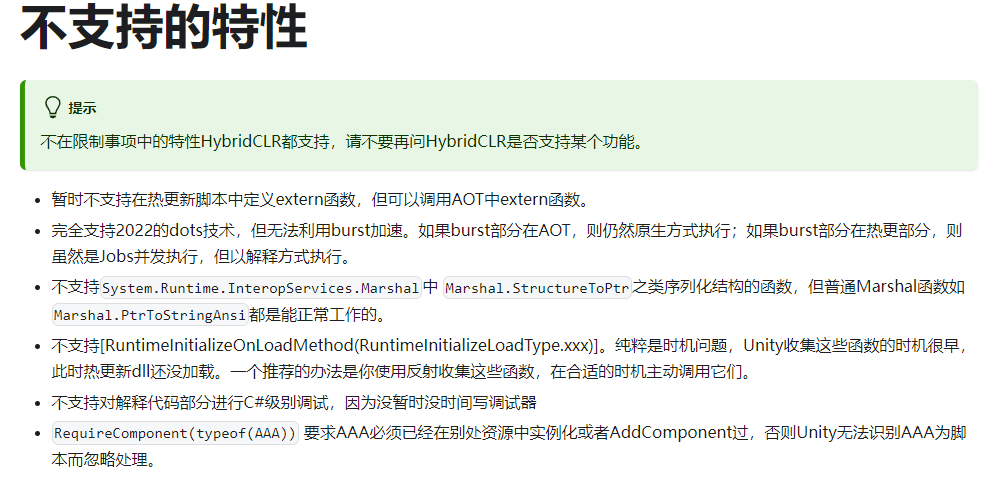

+++
title = "游戏开发 移动端热更"
date = "2024-07-25 10:27:00 +0800"
tags = ["Game Design", "technology"]
categories = ["technology"]
slug = "Game Development Mobile Hot Update"
indent = false
dropCap = false
# katex = true
+++

>  独立开发的时候有很长一段时间都在前面游戏玩法的设计，能撑到想要上线，并且需要热更维护的开发者少之又少。如何优雅的解决热更新问题似乎是一种甜蜜的烦恼。

本篇文章写于2023年10月底，在游戏行业，或者更确切一点Unity游戏开发行业，几乎清一色你会发现所有的招聘，对面试者的要求总会有这么一项：熟练掌握 Lua。Lua可以说是Unity开发行业的必备技能，他是众多热更方案中最为成熟的。AssetBundle + Lua 似乎成为了行业的通用答案，可惜，这篇文章我不讲Lua，我想学的是一个我认为更简洁优雅的方案 HybirdCLR + Addressables.

## 代码热更
### Lua

**Lua 系热更**  

Lua并非专门为热更开发的语言，Lua是由C语言编写的脚本语言，体积小巧非常精简，如果你有C/C++的基础，便可以急速上手。和Python一样，它属于解释型语言，不需要预编译或者是动态解析，它很适合作一种“胶水语言”用来胶合其他语言框架。
- 所以Lua体积小巧：不会热更项目的打包体积造成很大的影响。
- 性能上表现良好：虽然无法做到原生C#的性能，但对于资源热更脚本来说也没什么问题。  
  
这两点优势使得Lua似乎变得很适合做热更中间件。(其实世界上有很多语言都适合做热更，只是由于当时时代的资源倾斜，使得某一项技术得到青睐，进而雪球越滚越大)

比如Pyhton也适合做热更语言，而且有很多服务器端会使用Python，并且2023年AI的崛起，Python无疑是当下最为流行的语言。那为啥没人用Python？我认为原因有很多：
- 在Lua没有登上Unity热更宝座之前，其他引擎例如Cocos，CryEngine等都支持Lua更新，甚至连大名鼎鼎的魔兽世界也使用Lua作为热更语言，这无疑肯定了Lua在热更新领域的地位。会Lua热更的程序员似乎更吃香一些。当然，直到现在也是，你不会Lua，大概率无法进入到一个技术栈固定下来的团队 (但是追求创新和探索的团队并不会在意你会不会Lua)。
- 以前的游戏大部分是PC端游，语言除了Unity引擎使用的C#/JS外，绝大多数是C/C++，所以通用的服务器脚本也是Lua为主。在C家族看来，Python是个优雅的异类。

**Lua 与 HybirdCLR**

那么为啥我不学Lua呢，我对比了 HybirdCLR 的方案，还是觉得Lua有一些地方有局限性：
- 语言使用： Lua使用的就是Lua语言，热更新的Lua代码通过资源更新的方式下载到包中，程序加载Lua代码并交给Lua虚拟机执行；HybirdCLR热更不需要额外使用其他语言，写好你的C#就行，HybirdCLR 拓展了il2cpp，使得可以通过动态加载dll来执行更新。
- 热更范围：Lua开发的所有脚本都可以热更，C#开发的代码可以通过提前的hotfix来做热更补丁，但是你无法预判哪些代码需要进行热更，或者是打标记之后管理上会增加额外的工作; HybirdCLR 的更新范围几乎没有限制，唯一需要注意的是，你需要将需要热更代码所在的程序集装载到il2cpp，然后正常打包，到时候直接替换dll即可，基本上没有不能热更的内容。
- 新旧版本性能：Lua需要执行热更改的解释型Lua脚本实现数据或是代码的更新；HybirdCLR 在热更前后，执行的代码还是 native 的原生代码，相当于重新打了一次包编译得到的结果。
- 使用便捷性：Lua我就不讲了，需要Lua和C#的互相调用；HybirdCLR 需要添加热更程序集，然后直接修改代码即可。

可以说是，HybirdCLR在每方面都优于xLua的方案。只不过因为现有项目的技术栈已经再用Lua了，以及团队中的人更熟悉Lua，学习新的HybirdCLR可能并不如Lua。

### HybirdCLR
在介绍HybirdCLR之前，我们需要知道Unity的后端编译的知识。Unity 有 2 种类型的后端: **Mono** 与 **il2cpp**

在介绍Mono和il2cpp之前，我们需要知道什么是 AOT 和 JIT 编译：
**AOT（Ahead of Time）**，它将代码在程序运行之前编译成机器码。在Unity中，AOT编译器将C#代码转换为本机机器码，以便在目标平台上直接执行。这种方式可以提高代码的执行效率，因为代码已经被编译成机器码，无需在运行时进行解释和即时编译。

**JIT（Just-in-Time）**，它在程序运行时将代码动态地编译成机器码。在Unity中，JIT编译器将 IL（Intermediate Language）代码转换为机器码。IL代码是在C#代码编译为中间表示后的形式，它包含了程序的逻辑和结构，但还没有被直接编译成机器码。JIT编译器在程序运行时根据需要将IL代码编译成机器码，并执行编译后的代码。

那么 HybirdCLR 是如何做热更的？

在Unity中，默认情况下，Mono运行时使用JIT编译器来执行C#代码。然而，Unity也提供了AOT编译的选项，原始il2cpp相当于只有 AOT 的 Mono，而HybridCLR则给il2cpp新增了原生的interpreter模块，使得il2cpp变成一个有mono功能的 JIT，原生（即通过System.Reflection.Assembly.Load）支持动态加载dll.

所以呢？

所以我们使用 HybirdCLR 的时候，做热更的时候，你就直接改C#代码就行了。

吹了很久 HybirdCLR，现在说一说它的局限性：
首先是官方提供的不支持的特性(其实一般情况下这些特性遇不到，或者是可以想办法绕开)  

还有使用上需要注意的：
- 只可以使用il2cpp，大型项目的打包会很耗时
- 对于需要热更新的代码应该拆分为独立的程序集，才能方便地热更新
- 挂载热更新脚本的资源（场景或prefab）必须打包成ab，从ab包中实例化资源，才能正确还原脚本(在实例化资源前先加载热更新dll)；如果将热更新脚本挂载到Resources等随主包的资源上，会发生scripting missing的错误

## 资源热更

### AssetBundle

**AssetBundle** 是一个存档文件，包含可在运行时由 Unity 加载的特定于平台的非代码资源（比如模型、纹理、预制件、音频剪辑甚至整个场景）。 AssetBundle 可以表示彼此之间的依赖关系； 例如，一个 AssetBundle 中的材质可以引用另一个 AssetBundle 中的纹理。 为了提高通过网络传输的效率，可以根据用例要求（LZMA 和 LZ4）选用内置算法选择来压缩 AssetBundle。

AssetBundle 可用于可下载内容（DLC），减小初始安装大小，加载针对最终用户平台优化的资源，以及减轻运行时内存压力。

为什么我偏向于Addressable? 一言以蔽之：  
<!-- **Methods of building AssetBundles**：*使用 Addressables 包。这是推荐的、更用户友好的选项，可以直接从 Addressables UI 定义和构建 AssetBundle。它使用相同的基础文件格式和相同的低级 Unity 加载和缓存服务，但间接通过更高级别、更抽象的 API. ——— Unity Documentation v2023.1* -->


使用 Addressables 包。这是推荐的、更用户友好的选项，可以直接从 Addressables UI 定义和构建 AssetBundle。它使用相同的基础文件格式和相同的低级 Unity 加载和缓存服务，但间接通过更高级别、更抽象的 API.


其实可以把Addressable看作AssetBundle的升级版，其实使用方法是很类似的，只是更加便捷了。  
~~我也不明白为啥有很多人还是对AssetBundle有很深的执念，对新技术有一些排斥的心理，似乎也是因为老项目难以迁移或者重构。~~

### Addressable

首先Addressable其实使用的就是AssetBundle的系统，新增了管理资源的UI界面。  
在我看来，他们其实就类似于一个压缩包，只不过这个压缩包**可以寻址**，可以放在本地应用程序中，也可以**部署到远程分发网络**上。Unity程序会根据地址访问你打包的资源，那么由于这些压缩包是可以放在网络上的，所以也就提供了**资源热更新**的可能性。

如何使用其实也要看项目的需求了，具体的操作方式也比较简单，因为Unity提供了一些UI。文档也比较清楚。

[Unity3D Addressables 文档](https://docs.unity3d.com/Packages/com.unity.addressables@2.0/manual/index.html)

**文章正在加载中...**  
**Posts Loading...**

## Ref  
https://hybridclr.doc.code-philosophy.com/

 [**作者博客：YMX's Site**](https://yangmingxian.com)  
 [**作者B站视频：CyberStreamer**](https://space.bilibili.com/22212765)

