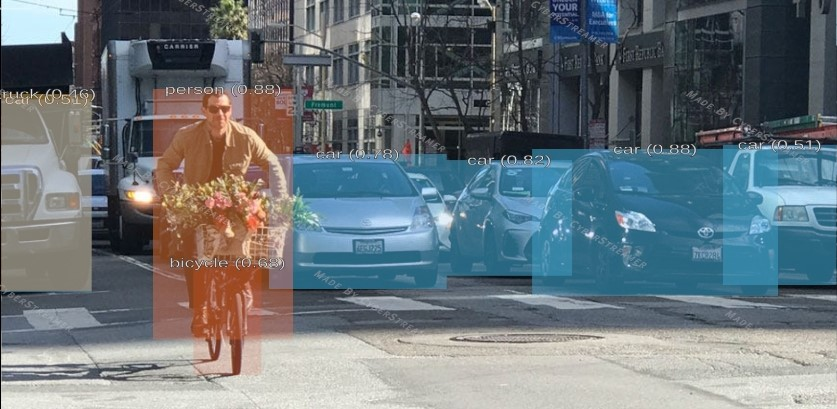
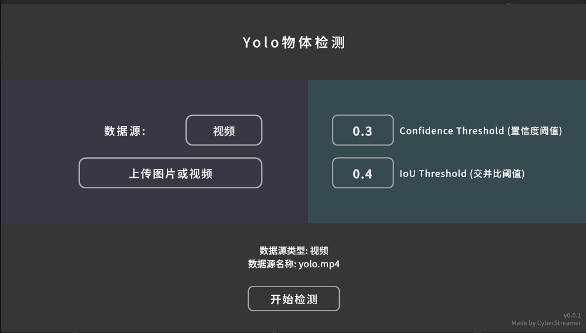
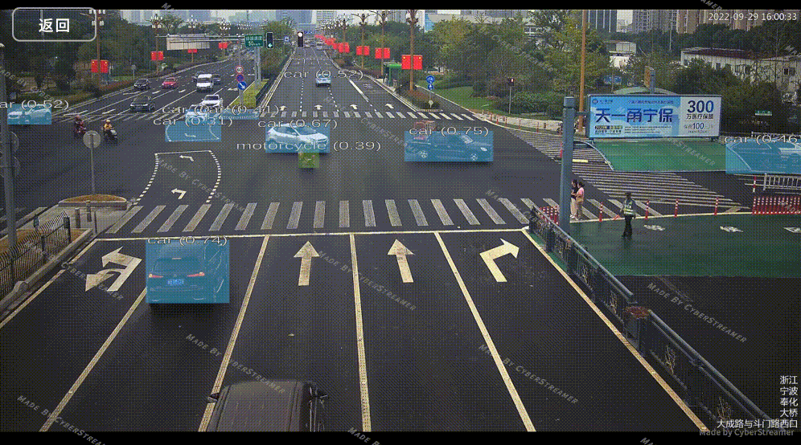

+++
title = "Unity中实现Yolo的实时目标检测"
date = "2024-11-08 15:33:00 +0800"
tags = ["AI", "Unity", "technology"]
categories = ["technology"]
slug = "Implementing real-time object detection with Yolo in Unity"
indent = false
dropCap = false
katex = true
+++




> 很久之前写过一篇比较粗略的图像识别的文章，感觉那时候的 Unity 用作推理 onnx 模型的 Barracuda 包还不是特别成熟，
> 我想在一个游戏中集成一个很有趣的模型，它使用的 conv 的动态权重，使用 Unity 进行推理时，Barracuda 不支持 conv 的动态权重（[Github的Issue在此](https://github.com/Unity-Technologies/barracuda-release/issues/327)）。
 

> 在 Unity6 发布之前我就获取了 Sentis 的内测资格，但是一直没有时间更新它，最近又有B站的朋友问我 Yolo 的事情，干脆这里直接使用最新的 Unity6 + Sentis 版本做一个 Yolo 的集成。
> 希望对有需求的人有所帮助

#### 整体流程概述

如果你有现成的 Yolo 的 onnx 格式的模型，那么其实使用 Unity 进行推理就变得很简单了。

想办法让Unity的输入匹配 onnx 模型的输入（幸运的是，Yolo 模型已经内置了裁剪扩充的步骤，你直接丢 Texture 进去就可以了）。  
使用 Sentis 库将 Texture 转换成 Tensor 并输入模型进行推理，得到输出的 ```outputTensor```。  
你需要做的就时处理这些 Tensor 转换成自己想要的形式。  

Yolo 模型的输出 ```outputTensor``` 通常包含每个检测框的边界框信息、类别得分以及目标置信度。最后根据这些数据，将框体绘制出来即可。

#### 目标检测流程概述

```csharp
// 获取数据源输入
Texture texture = source.GetTexture();
// 清除识别框
screen.ResetBoundingBoxes();
// 数据源显示
screen.SetTexture(texture);
// 输入张量
Tensor<float> inputTensor = TextureConverter.ToTensor(texture, TARGET_WIDTH, TARGET_HEIGHT, 3);
// 运行模型
worker.Schedule(inputTensor);
// 获取输出张量
Tensor<float> outputTensor = worker.PeekOutput() as Tensor<float>;
// 处理模型的输出
List<YoloPrediction> predictions = yolo.Predict(outputTensor, TARGET_WIDTH, TARGET_HEIGHT);
// 绘制识别框
screen.DrawBoundingBoxes(predictions);
// 释放非托管的张量资源
outputTensor.Dispose();
inputTensor.Dispose();
```

**1. 获取输入数据**
首先，我们需要从数据源中获取当前图像或视频帧。数据源可以是来自摄像头、视频文件或屏幕截图等。获取到的图像会作为目标检测模型的输入。

**2. 数据预处理**
获取的图像通常不是模型所需要的标准格式，因此需要对其进行预处理。这个步骤包括调整图像的尺寸，使其符合模型的输入要求，通常还需要将图像从常见的颜色空间（如 RGB）转换为适合神经网络处理的格式，比如标准化成浮动数值。数据预处理的目的是确保输入数据能够被正确地送入模型进行推理。

**3. 模型推理**
接下来，图像经过预处理后会被传递到目标检测模型进行推理。模型根据输入的图像进行处理，生成一系列的预测输出。每个预测输出通常包含多个信息，如检测框的位置、类别以及每个检测框的置信度分数。推理过程是在后端处理的，通常是通过调用预先训练好的模型来进行的。

**4. 处理输出结果**
模型推理后返回的输出数据需要进一步处理。通常，输出是以张量（Tensor）的形式返回的，其中包含了多个检测框的信息。我们需要将这些原始输出数据转化为人类可读的预测信息，比如目标的类别、置信度以及框的位置等。此时，我们还可能应用如 非最大抑制（NMS）这样的技术来筛选出最终有效的检测框。

**5. 可视化结果**
当得到最终的预测结果后，我们会在图像上绘制出目标检测框，显示识别出来的物体及其类别。这些检测框帮助我们直观地看到模型预测的目标位置，并通过置信度分数来评估模型的准确性。通常会在图像的每个目标区域画出矩形框，并标上对应的类别名称。

**6. 释放资源**
在每一帧图像处理完成后，我们需要进行资源的清理。图像和模型的输入输出都涉及到内存操作，因此，及时释放不再使用的内存对于性能优化至关重要。清理过程包括销毁不再需要的图像数据和释放推理过程中占用的内存，确保不会发生内存泄漏。

#### 处理模型输出

方法 ```Predict``` 接收 YOLO 模型的输出张量 (```outputTensor```)，以及图像的宽高（```imageWidth``` 和 ```imageHeight```），返回检测到的对象列表 ```List<YoloPrediction>```。它的主要流程是：

**1. 固定张量数据到 GPU**  
首先，将预测输出张量固定到 GPU 内存，以便后续的 ```ComputeShader``` 可以直接访问它的数据。在 Unity 中，```ComputeShader``` 负责在 GPU 上处理数据，因此输出张量必须通过固定（Pinning）操作，让其内容可用于 GPU 计算。固定操作会返回一个引用，确保 ```ComputeShader``` 能访问它。在开始处理前，我们还要进行空值检查，以防张量数据缺失导致后续的处理失败。

**2. 初始化和复用缓冲区**  
在进行预测前，我们需要为数据传输创建一系列缓冲区。这个步骤的目的在于初始化或复用现有的 GPU 缓冲区，避免重复创建。

- **边界框缓冲区**：保存检测到的边界框（```Bounding Boxes```）的数据，每个框对应4个浮点数，表示位置和大小。
- **类别索引缓冲区**：保存检测到的对象类别索引，用于后续映射成具体类别名称。
- **分数缓冲区**：保存每个检测到的对象的置信分数。
- **有效检测计数缓冲区**：用于存储有效检测的数量，这在后续读取检测结果时会派上用场。
在第一次调用或检测数量发生变化时，这些缓冲区会被创建或重新分配，否则会重复利用现有缓冲区，从而优化性能。

**3. 设置 Shader 参数和绑定缓冲区**  
一旦所有缓冲区准备好，就可以配置 ```ComputeShader``` 的各项参数。这包括：

- **设置检测参数**：将检测数量、类别数量、图像宽度和高度等参数传递给 ```ComputeShader```。这些参数帮助 Shader 了解每个检测的细节和图像的分辨率。
- **绑定缓冲区**：将输出张量、边界框、类别索引、分数以及有效检测计数等缓冲区绑定到 Shader 上，以便其直接读写这些缓冲区的数据。
设置完参数后，```ComputeShader``` 可以根据这些参数和缓冲区，处理张量数据并生成检测结果。

**4. 执行 Shader 处理**  
接下来是执行 ```ComputeShader```，将张量数据转化为具体的检测输出。这一步中：

- ```ComputeShader``` 会在 GPU 上运行一个计算任务，按照配置的线程组数分配计算资源。
- 每个线程组负责处理一部分数据，确保所有检测数据都经过处理。
运行 ```ComputeShader``` 的好处在于它能高效利用 GPU 资源，快速解析出每个检测框的边界框坐标、类别索引和置信分数。

**5. 从 GPU 获取结果**  
当 ComputeShader 处理完成后，我们需要将检测结果从 GPU 读取回主内存：

- **读取有效检测计数**：从缓冲区中获取有效检测数量，以确定实际有效的检测结果数量。
- **读取检测结果数据**：分别将边界框、类别索引和置信分数的数据读取到数组中，这些数组会存储检测对象的所有信息。
读取操作将这些数据从 GPU 的缓冲区复制到 CPU 侧的内存中，为后续数据处理步骤准备数据。

**6. 转换为 YoloPrediction**  
数据读取完成后，我们需要将其转换为便于处理的预测对象列表。我们遍历读取的数据，将每个检测对象的边界框、类别索引和置信分数封装成 ```YoloPrediction``` 对象。在封装过程中：

- **类别映射**：每个类别索引会被映射成对应的类别名称，这样更直观。
- **颜色赋值**：给每个检测的类别分配一个颜色，方便在显示时区分不同的对象。
- **边界框坐标转换**：确保边界框数据符合后续显示或操作的格式。
生成的 ```YoloPrediction``` 列表就是最终的检测结果，我们还会应用非极大值抑制（NMS）来去除重叠的框，确保预测结果简洁高效。NMS 可以帮助保留置信分数最高的检测，并去掉与之重叠的其他低分数框。


> *Tip: 将 outputTensor 分拆成多个缓冲区，是为了利用计算着色器（Compute Shader）的并行计算能力，提升处理效率。这种设计非常适合大规模 GPU 并行处理，尤其在执行复杂的后处理步骤如非极大值抑制（NMS）时，可以显著提升性能和速度。*
```CSharp
public void InitializeBuffers(int numDetections)
{
    // 创建或复用缓冲区
    outputBoxesBuffer ??= new ComputeBuffer(numDetections, sizeof(float) * 4);
    outputClassesBuffer ??= new ComputeBuffer(numDetections, sizeof(int));
    outputScoresBuffer ??= new ComputeBuffer(numDetections, sizeof(float));
    validDetectionCounterBuffer ??= new ComputeBuffer(1, sizeof(uint), ComputeBufferType.Raw);
}

public List<YoloPrediction> Predict(Tensor<float> outputTensor, int imageWidth, int imageHeight)
{
    // 1. 固定张量数据到 GPU
    ComputeTensorData computeTensorData = ComputeTensorData.Pin(outputTensor);
    if (computeTensorData == null)
    {
        Debug.LogError("Output Tensor not found!");
        return null;
    }

    int numDetections = outputTensor.shape[2];
    InitializeBuffers(numDetections);  // 初始化或复用缓冲区
    validDetectionCounterBuffer.SetData(new uint[] { 0 });  // 计数缓冲区初始化为 0

    // 2. 设置 Shader 参数和绑定缓冲区
    int kernelHandle = postProcessingShader.FindKernel("CSMain");
    postProcessingShader.SetFloat("confidenceThreshold", confidenceThreshold);
    postProcessingShader.SetInt("numDetections", numDetections);
    postProcessingShader.SetInt("numClasses", 80);  // 固定为 COCO 数据集类别
    postProcessingShader.SetInt("imageWidth", imageWidth);
    postProcessingShader.SetInt("imageHeight", imageHeight);

    postProcessingShader.SetBuffer(kernelHandle, "outputTensor", computeTensorData.buffer);
    postProcessingShader.SetBuffer(kernelHandle, "outputBoxes", outputBoxesBuffer);
    postProcessingShader.SetBuffer(kernelHandle, "outputClasses", outputClassesBuffer);
    postProcessingShader.SetBuffer(kernelHandle, "outputScores", outputScoresBuffer);
    postProcessingShader.SetBuffer(kernelHandle, "validDetectionCounter", validDetectionCounterBuffer);

    // 3. 执行 Shader 进行处理
    int threadGroups = Mathf.CeilToInt((float)numDetections / 256);
    postProcessingShader.Dispatch(kernelHandle, threadGroups, 1, 1);

    // 4. 从 GPU 中读取有效检测数量和结果
    uint[] validDetectionCountArray = new uint[1];
    validDetectionCounterBuffer.GetData(validDetectionCountArray);
    int validDetectionCount = (int)validDetectionCountArray[0];

    float[] boxes = new float[validDetectionCount * 4];
    int[] classes = new int[validDetectionCount];
    float[] scores = new float[validDetectionCount];

    outputBoxesBuffer.GetData(boxes, 0, 0, validDetectionCount * 4);
    outputClassesBuffer.GetData(classes, 0, 0, validDetectionCount);
    outputScoresBuffer.GetData(scores, 0, 0, validDetectionCount);

    // 5. 将检测结果转换为 YoloPrediction 对象列表
    List<YoloPrediction> predictions = new();
    for (int i = 0; i < validDetectionCount; i++)
    {
        predictions.Add(new YoloPrediction
        {
            ClassIndex = classes[i],
            ClassName = YoloLables.GetClassName(classes[i]),
            ClassColor = YoloLables.GetClassColor(classes[i]),
            Score = scores[i],
            BoundingBox = new Rect(boxes[i * 4], boxes[i * 4 + 1], boxes[i * 4 + 2], boxes[i * 4 + 3])
        });
    }

    // 6. 清理 GPU 资源并应用非极大值抑制
    computeTensorData.Dispose();
    return ApplyClassWiseNonMaxSuppression(predictions, iouThreshold);
}
```


#### 检测框体处理  
用于在目标检测任务中去除重复或高度重叠的检测框。以下是各个步骤的详细解释：

**1. 基于类别的非极大值抑制 (ApplyClassWiseNonMaxSuppression)**  
```csharp
private List<YoloPrediction> ApplyClassWiseNonMaxSuppression(List<YoloPrediction> predictions, float iouThreshold)
{
    // Group the predictions by class
    var groupedByClass = predictions.GroupBy(p => p.ClassIndex);

    List<YoloPrediction> finalPredictions = new();

    // Apply Non-Max Suppression for each class group
    foreach (var classGroup in groupedByClass)
    {
        finalPredictions.AddRange(ApplyNonMaxSuppression(classGroup.ToList(), iouThreshold));
    }

    return finalPredictions;
}
```
  1. **按类别分组**：首先，将 ```predictions```（所有检测结果）按类别（```ClassIndex```）进行分组。这样，可以对每个类别单独应用非极大值抑制。
  2. **初始化列表**：```finalPredictions``` 用于存储最终的检测结果。
  3. **应用 NMS**：遍历每个类别的预测列表（```classGroup```），对其中的每一类分别调用 ```ApplyNonMaxSuppression``` 方法。
  4. **返回结果**：将所有经过 NMS 筛选后的检测结果添加到 ```finalPredictions```，并返回。

**2. 非极大值抑制 (ApplyNonMaxSuppression)**  
```csharp
private List<YoloPrediction> ApplyNonMaxSuppression(List<YoloPrediction> predictions, float iouThreshold)
{
    // Sort predictions by confidence in descending order and initialize result list
    predictions.Sort((p1, p2) => p2.Score.CompareTo(p1.Score));
    List<YoloPrediction> result = new();

    while (predictions.Count > 0)
    {
        // Select the prediction with the highest confidence
        var bestPrediction = predictions[0];
        result.Add(bestPrediction);
        predictions.RemoveAt(0);

        // Remove predictions that have a high IoU with the selected prediction
        predictions.RemoveAll(prediction => CalculateIoU(bestPrediction.BoundingBox, prediction.BoundingBox) > iouThreshold);
    }
    return result;
}
```
  1. **按置信度排序**：```predictions.Sort``` 将每个检测结果按置信度（Score）从高到低排序，这样可以优先处理置信度高的预测框。
  2. **初始化结果列表**：```result``` 用于存储筛选后的预测。
  3. **选择置信度最高的预测**：在每个循环中，取出剩余预测框中置信度最高的（即```predictions[0]```），并将其添加到 ```result``` 中。
  4. **移除重叠框**：在 ```predictions``` 中，移除与当前置信度最高预测框（```bestPrediction```）重叠过大的预测框（通过 ```CalculateIoU``` 方法计算交并比）。若重叠程度超过阈值（```iouThreshold```），则移除。

**3. 计算交并比 (CalculateIoU)**  
```csharp
private float CalculateIoU(Rect boxA, Rect boxB)
{
    float intersectionWidth = Mathf.Max(0, Mathf.Min(boxA.xMax, boxB.xMax) - Mathf.Max(boxA.xMin, boxB.xMin));
    float intersectionHeight = Mathf.Max(0, Mathf.Min(boxA.yMax, boxB.yMax) - Mathf.Max(boxA.yMin, boxB.yMin));
    float intersectionArea = intersectionWidth * intersectionHeight;

    float unionArea = boxA.width * boxA.height + boxB.width * boxB.height - intersectionArea;
    return intersectionArea / unionArea;
}
```
1. **计算交集宽度和高度**：先计算两个框的交集宽度和高度。如果没有交集，宽度和高度为 0。
2. **计算交集面积**：使用交集宽度和高度计算交集面积。
3. **计算并集面积**：两个框的面积相加，减去交集面积。
4. **计算 IoU**：将交集面积除以并集面积得到交并比（IoU），这是判断两个框重叠程度的指标。
通过这些步骤，```ApplyClassWiseNonMaxSuppression``` 可以过滤掉多余的检测框，保留不同类别中置信度高且不重叠的检测结果。


#### 输入与输出

输入数据分三种：图片、视频和摄像头，这里以视频为例：  
其实只有简单的初始化，然后获取文件地址以加载。  
```Tensor<float> inputTensor = TextureConverter.ToTensor(texture, TARGET_WIDTH, TARGET_HEIGHT, 3);```    
将 Texture 传参给上面提到的模型即可。  

```csharp
public VideoSource(string path)
{
    videoPlayer = GameObject.Find("Video Player").GetComponent<VideoPlayer>();
    videoPlayer.url = path;

    videoPlayer.Prepare();

    // 等待视频准备好，获取宽高
    videoPlayer.prepareCompleted += (source) =>
    {
        originalSize = new Vector2Int((int)videoPlayer.width, (int)videoPlayer.height);
        Debug.Log($"Video loaded with size: {originalSize.x} x {originalSize.y}");
    };
}

public override Texture GetTexture()
{
    return videoPlayer.texture;
}
```

为了优化，每帧最好只处理一次，不要直接在 Update 里面之直接写循环，判断一下以节省资源。

```csharp
public override bool IsFrameReady()
{
    // 判断是否第一帧是就绪的
    if (videoPlayer.isPlaying && videoPlayer.frame > 0)
    {
        // 只处理新的帧
        if (videoPlayer.frame != lastProcessedFrame)
        {
            lastProcessedFrame = videoPlayer.frame;
            return true;
        }
    }
    return false;
}
```

#### Result

