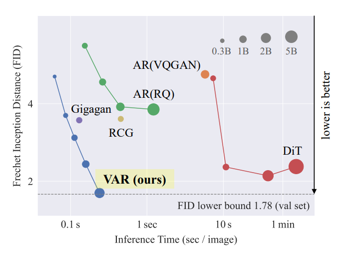
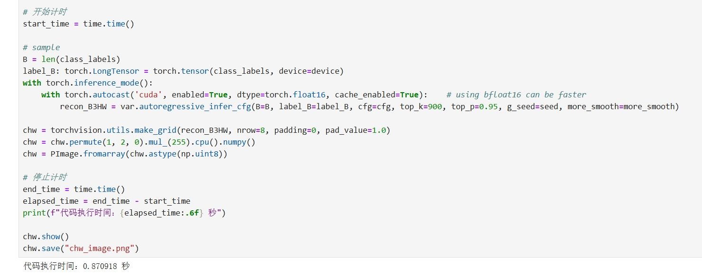
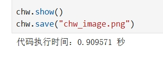
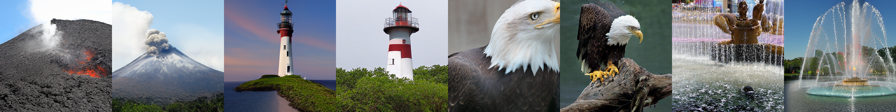
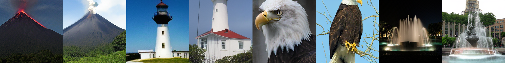

+++
title = "基于分辨率缩放的高效图像生成模型"
date = "2024-12-04 14:56:00 +0800"
tags = ["AI"]
categories = ["technology"]
slug = "Efficient image generation model based on resolution scaling"
indent = false
dropCap = false
# katex = true
math = true
+++


### 前言

> *起因是朋友给我发了字节的哪个新瓜，我对吃瓜完全没有兴趣，反倒是作者的这个新模型说是已经超越了现有的扩散模型。*
 
还记得当时扩散模型刚出来的时候，我感觉很神奇，因为当时还是生成式对抗网络(GAN)的天下，扩散模型生成的原理属于是另起炉灶，正反向添加噪声的角度实在是让人感到很新奇。从人类画画的角度来看，这种思路过于清奇，不过也确实是得到了未来，也就是这几年的验证，各种AIGC层出不穷。

那么我想看看这回有可能打破绝对领先地位的模型的论文又是什么个思路。更何况这还是实习生的主要贡献，好奇甚于崇拜。

这里是作者开源的仓库地址: [**VAR Github**](https://github.com/FoundationVision/VAR)

### 模型简介

这个图像生成模型 **Visual AutoRegressive (VAR)**，不再按照传统的像素或令牌的栅格扫描顺序生成，而是采取从粗到细的多尺度**下一分辨率预测**方法。每一阶段，VAR以更高分辨率生成图像特征。

我不太喜欢什么高深的专业名词解释，举个简单的例子对比一下：  
- 传统的像素或令牌栅格扫描方式就像一个画家从左上角开始逐个画网格，每次只完成一个小格子的内容。画完左上角的网格后，他继续到下一个，直到整张画布填满。这种方法可能容易缺乏整体感。
- 而VAR的“从粗到细”多尺度预测方法是，它先生成低分辨率的整体轮廓（比如32×32）。
再逐步提升分辨率，在更高分辨率的基础上填充更多细节（如64×64、128×128，直到目标分辨率）。这种方法在我看来更符合人类的视觉习惯。这个过程是从整体到局部的，从粗略到精细，保证了画面一开始就有全局感，并且细节逐步被填充。

### 主要贡献

相信其他文章都已经写的很多了，如果你不想看那些复杂专业的词汇和分析。我这里用我的大白话概括一下。其实所有的贡献都是因为这种思路改变带来的。

1. 性能提升。更快了，之前的扩散模型的逐步过程是对图形去马赛克化，每个逐步过程都是对整个图像有开销的。但是新的VAR使用的是从低分辨率到高分辨率的逐步过程，这个过程中减少了很多暴力计算的开销。所以模型生成的更快了（大约是扩散模型的几十倍）。
2. 扩展性优势。
   - 对于不同任务类型的扩展：VAR无需额外训练便能在图像补全（in-painting）、扩展（out-painting）和编辑等任务中展示优秀表现。不需要再单独训练。因为它本身就是在做类似于补全和细化的工作。
   - 对于图像规模的增大：VAR模型的扩展符合类似语言模型的幂律缩放定律，规模提升时性能几乎线性增强。通俗理解就是：这个模型和大多数现代AI一样，越多的数据和计算资源喂给它，生成的图像质量就越高，而且这提升在一定程度上是线性且规律的。


### 技术细节
我看着也费劲，可以不看，但是我写了。~~要不然文章显得不够专业（这句话标记要删掉）~~。能看懂的也不要在我这里看，去看原文！

#### 多尺度量化编码器（VQVAE）
VAR模型的输入处理由一个改进版的VQVAE完成，该模块将图像转换为多尺度的离散表示（Token Map）

##### 核心步骤

1. **图像编码**     
   - 原始图像 $\operatorname{im}$ 经过编码器 $E(\cdot)$ ，被映射为连续的特征图 $f \in \mathbb{R}^{h \times w \times C}$ 。  
     
   - 编码器的结构采用卷积网络提取多尺度特征。   

```python
# 编码阶段伪代码
def multi_scale_encoding(image):
    f = encoder(image)  # 提取特征图
    R = []  # 存储多分辨率令牌图
    for k in range(1, K+1):
        r_k = quantize(interpolate(f, h_k, w_k))  # 量化当前分辨率
        R.append(r_k)
        z_k = lookup_codebook(r_k)
        z_k = upsample(z_k, h, w)
        f = f - convolution(z_k)  # 残差
    return R
```

2. **多尺度量化**  
   - 特征图 $f$ 被逐步下采样，生成 $K$ 个不同分辨率的特征图 $f_k$。 
   - 每个 $f_k$ 经矢量量化模决 $Q(\cdot)$ ，映射为离散的令牌图 $r_k \in[V]^{h_k \times w_k}$ ，其中 $V$ 是共享的代码表 (Codebook) 大小。  
   - 残差设计：令 $f$减去由量化生成的重建值 $ϕ_k(z_k)$（使用卷积网络处理），剩余信息传递到下一分辨率层。

3. **解码器重建**  
   - 多尺度令牌图 {$r_1, r_2, \ldots, r_K$} 经解码器 $D(\cdot)$ 重建为最终图像 $\mathrm{im} 。$

```python
# 重建阶段伪代码
def multi_scale_decoding(R):
    f_hat = 0  # 重建的特征图初始化
    for r_k in R:
        z_k = lookup_codebook(r_k)
        z_k = upsample(z_k, h, w)
        f_hat += convolution(z_k)
    return decoder(f_hat)  # 生成图像
```

##### 量化公式
   - 令 $Z \in \mathbb{R}^{V \times C}$ 为代码表。
   - 每个特征向量 $f^{(i, j)}$ 被量化为代码表中最近的向量:

$$
q(i, j)=\arg \min _{v \in[V]}\left\|Z[v]-f^{(i, j)}\right\|_2^2
$$

##### 训练目标

- 综合损失函数:
    $$
    L=\|\mathrm{im}-\mathrm{im}\|_2^2+\|f-\hat{f}\|_2^2+\lambda_P L_P(\hat{\mathrm{im}})+\lambda_G L_G(\hat{\mathrm{im}})
    $$
    其中：
    - $L_P$：感知损失（类似于LPIPS）。
    - $L_G$：判别器损失（类似于StyleGAN中的对抗损失）。

#### 逐步分辨率预测生成流程
VAR引入了一种新的自回归生成范式，每次生成完整的令牌图（Token Map），而不是单个令牌。

**生成过程**
  1. 初始输入
     - 令$r_1$为最粗分辨率的令牌图（比如1×1）
     - 条件信息（如类标）用作起始令牌 $[S]$。

  2. 逐步生成更高分辨率
     - 从$r_1$开始，逐步预测 $r_2,...,r_K$，直到达到目标分辨率。
     - 每一步的生成通过Transformer完成，公式为:

$$p\left(r_1, r_2, \ldots, r_K\right)=\prod_{k=1}^K p\left(r_k \mid r_1, \ldots, r_{k-1}\right)$$

  3. 并行令牌生成
     - 在每一阶段，所有令牌 $r_k$ 内的元素是同时生成的，而不是逐个生成。

  4. 注意力掩码
     - 使用分块掩码保证第 $k$ 层令牌图只依赖于 $r≤k$。


#### Transformer架构
用于“下一分辨率预测”的模型是一个标准的解码器式Transformer

**主要组件：**
1. 输入嵌入：
   - 将令牌图 $r_k$ 的每个令牌通过嵌入层映射为高维向量。
   - 每个分辨率的令牌图配备特定的位置嵌入（Position Embedding），帮助Transformer识别空间关系。
2. 自注意力机制：
   - 每个Transformer层使用自注意力机制，计算令牌之间的依赖关系：
$$\operatorname{Attention}(Q, K, V)=\operatorname{Softmax}\left(\frac{Q K^T}{\sqrt{d_k}}\right) V$$
    其中 $Q$,$K$,$V$ 分别是查询、键和值向量。
3. 前馈网络（Feed-Forward Network）：
   - 线性层和激活函数的堆叠，用于非线性变换。
4. 层归一化（Layer Normalization）：
   - 使用了一种改进的自适应归一化（Adaptive Layer Normalization, AdaLN），适配不同的分辨率输入。


#### 生成细节和复杂度优化
1. Top-K采样：
   - 在推理时，只从概率最高的K个候选项中采样，避免低概率选项导致的生成错误。
2. 分辨率逐步提升：
   - 每一级生成的复杂度为 $O(n_k^4)$ 其中 $n_k$ 是当前分辨率的大小。
   - 整体复杂度为 $O(n^4)$ ，远低于传统自回归方法的 $O(n^6)$ 。

### 本地部署运行

1. 使用conda环境 python版本为3.10.x 
```conda create -n var python==3.10```

2. 选择正确的版本安装pytorch  
```pip install torch>=2.0.0```

1. 根据仓库的需求清单文件安装其他包  
```pip install -r requirements.txt```

1. 下载预训练的权重[vae_ch160v4096z32.pth](https://huggingface.co/FoundationVision/var/resolve/main/vae_ch160v4096z32.pth)  
放到项目目录下
2. 使用jupyter运行demo_sample.ipynb  
```jupytre lab```  
*如果Numpy报错，记得使用Numpy 1.x版本*


### Result

|   model    | reso. |   FID    | rel. cost | #params | HF weights🤗                                                                        |
|:----------:|:-----:|:--------:|:---------:|:-------:|:------------------------------------------------------------------------------------|
|  VAR-d16   |  256  |   3.55   |    0.4    |  310M   | [var_d16.pth](https://huggingface.co/FoundationVision/var/resolve/main/var_d16.pth) |
|  VAR-d20   |  256  |   2.95   |    0.5    |  600M   | [var_d20.pth](https://huggingface.co/FoundationVision/var/resolve/main/var_d20.pth) |
|  VAR-d24   |  256  |   2.33   |    0.6    |  1.0B   | [var_d24.pth](https://huggingface.co/FoundationVision/var/resolve/main/var_d24.pth) |
|  VAR-d30   |  256  |   1.97   |     1     |  2.0B   | [var_d30.pth](https://huggingface.co/FoundationVision/var/resolve/main/var_d30.pth) |
| VAR-d30-re |  256  | **1.80** |     1     |  2.0B   | [var_d30.pth](https://huggingface.co/FoundationVision/var/resolve/main/var_d30.pth) |




下面使用的是VAR-d16，生成的图像均为256*256分辨率，生成4种8张图片，参数如下:   
```python
# set args
seed = random.randint(1, 1000) #@param {type:"number"}
torch.manual_seed(seed)
num_sampling_steps = 500 #@param {type:"slider", min:0, max:1000, step:1}
cfg = 8 #@param {type:"slider", min:1, max:10, step:0.1}
class_labels = (980, 980, 437, 437, 22, 22, 562, 562)  #@param {type:"raw"}
more_smooth = True # True for more smooth output
```






得到的结果如上图所示，平均生成一张图片在0.1s左右，远远快于扩散模型....恐怖如斯。


### Outro
机器学习是统计学上的大力出奇迹。  
有些时候，我感觉这种奇思妙的结构更容易发生在一些不是完全专业的群体，或者是产生于一些不切实际的BrainStorm。  
有这么一个故事：就是如何能快速清理电线上面堆积的雪呢，一个非常高效的方法就来源于一个很不切实际的话语———开飞机飞到天上用扫帚清理它们。而被采用的方法正是飞机，不过没有扫帚，直升机引起的气流足以吹干净它们了。

回头想想扩散模型和这个放缩模型(VAR,我这么称呼它)，好像也有一种这样的感觉，思路清奇，但是不同的是，这些作者他们是专业人士hhhh。  
我期待runtime的AI模型推理应用到各处。视频、游戏、好像我们离摆脱长时间的推理时间不远了。拥抱无延迟的AIGC好像很快会到来。

也许很快它就会取代扩散模型，也许不会。也许它很快就又会被另外的模型取代。   
不过呢，暴力取优已经是人工智能默认的共识做法了，不过，是不是真的科技树点歪了，在一个不是那么合理的架构上登峰造极，等遇到了另一个更优的模型也许也不再会矫正了。  
不过在这个AI技术野蛮生长的时代，似乎迅速的淘汰更新才是常态。  
