+++
title = "Unity卡通水面着色器"
date = "2025-09-05 10:39:00 +0800"
tags = ["Game Design", "technology"]
categories = ["technology"]
slug = "Toon Water Shader in Unity"
indent = false
draft = true
# dropCap = false
# katex = true
+++

> 在这里分享一个比较详细的Shader教程，本教程将逐步教你写一个卡通的水面Shader，教程将使用深度和法线缓冲区中的数据来生成海岸线泡沫，并使用噪点和扭曲纹理来渲染卡通波浪。

# 开始

首先我准备了一个简单的示例场景和一个空的UnlitShader(将MainTex属性去除)，空的Shader代码可以在这里找到（[EmptyShader](EmptyShader.shader)）。

场景中有一个带有深度的坑，和几个可以漂浮的物件，然后使用一个plane平面来当作水面。
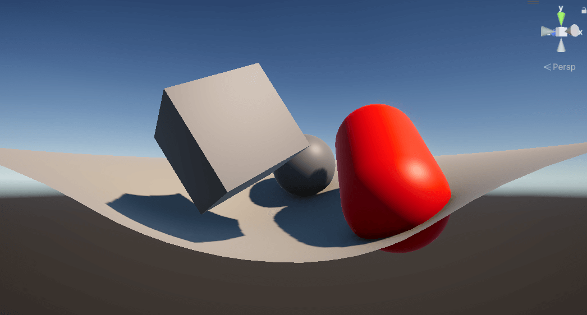

使用空的Shader创建一个材质，然后将材质复制到这个plane平面上，得到的结果如下：
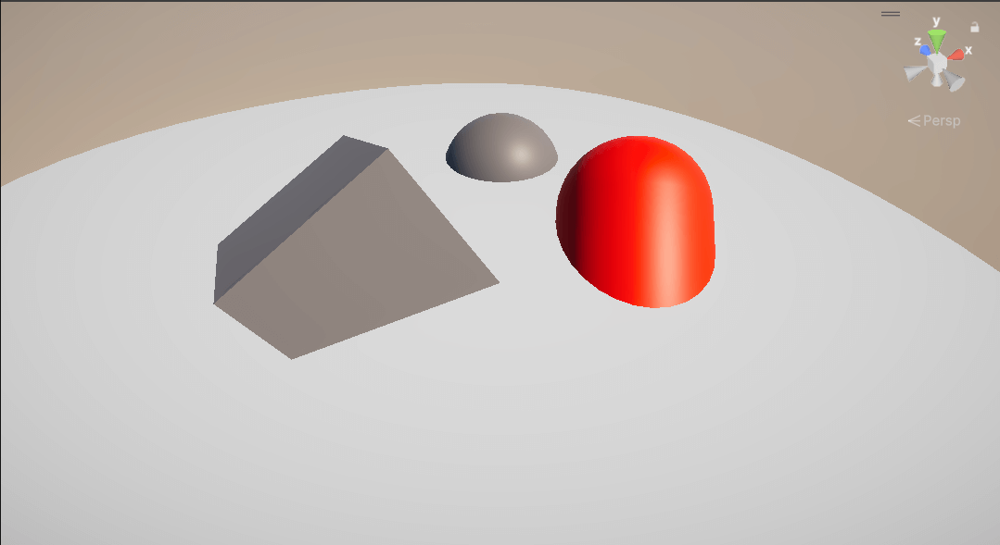

## 1.水面的颜色
除了透明之外，水的颜色应该和它的深度有关系，因为水会吸收穿过它的光，为了实现颜色随着水深而变化，我们使用渐变来代表水的颜色，渐变的参数由水的深度控制。

### 1.1基础颜色属性
我们在Shader的Properties中添加以下参数：

~~~HLSL
_DepthGradientShallow("Depth Gradient Shallow", Color) = (0.3, 0.875, 0.9, 0.75) // 浅水颜色
_DepthGradientDeep("Depth Gradient Deep", Color) = (0, 0.3, 1, 0.75)             // 深水颜色
_DepthMaxDistance("Depth Maximum Distance", Float) = 1                           // 水深和颜色映射的最大距离
~~~   

*请注意，这些属性已经填充了一些默认值。*   

我们用两种颜色定义渐变，一种代表水最浅时的颜色（它后面的物体几乎接触到水面时），另一种代表水最深时的颜色。由于水深可能无限大，我们添加了`_DepthMaxDistance`属性作为渐变的截止值——任何比这更深的水都不会再改变颜色而直接使用`_DepthGradientDeep`定义的深水颜色。

我们还需要声明这些参数，在片段着色器之前加入代码：
~~~HLSL
float4 _DepthGradientShallow;
float4 _DepthGradientDeep;
float _DepthMaxDistance;
sampler2D _CameraDepthTexture;
~~~

### 1.2基于水深的颜色
上面的代码声明了一个名为 `_CameraDepthTexture` 的 sampler2D 变量。这个声明的变量允许着色器访问相机的深度纹理。深度纹理是一张灰度图，距离相机较近的物体颜色较白，而距离相机较远的物体颜色较暗。

深度纹理是全屏纹理，它的尺寸与我们要渲染的屏幕尺寸相同。我们希望在与当前渲染像素相同的位置对该纹理进行采样。为此，我们需要在顶点着色器中计算顶点在屏幕空间中的位置，然后将该值传递给片段着色器以供使用。

~~~HLSL
// 在 v2f 结构体中填写
float4 screenPosition : TEXCOORD2;

// 在 顶点着色器中填写
o.screenPosition = ComputeScreenPos(o.vertex);
~~~

通过 v2f 结构体可以访问屏幕位置后，我们现在可以采样深度纹理了。将以下代码添加到片段着色器中。
~~~HLSL
float existingDepth01 = tex2Dproj(_CameraDepthTexture, UNITY_PROJ_COORD(i.screenPosition)).r;
float existingDepthLinear = LinearEyeDepth(existingDepth01);
~~~

第一行代码使用 `tex2Dproj` 和屏幕位置对深度纹理进行采样。这将返回水面后方表面的深度，范围在 0 到 1 之间。该值是非线性的——距离摄像机非常近的一米深度在深度纹理中表示的值，会比距离摄像机一公里的一米深度在深度纹理中表示的值更大。第二行代码将非线性深度转换为线性深度，以摄像机的世界单位表示。

*tex2Dproj和tex2D的区别在于：区别在于，tex2Dproj 会在采样纹理之前将输入 UV 的 xy 坐标除以其 w 坐标。这是为了将坐标从正交投影转换为透视投影。
以下代码的功能与 tex2Dproj 相同。*
~~~
float existingDepth01 = tex2D(_CameraDepthTexture, UNITY_PROJ_COORD(i.screenPosition.xy / i.screenPosition.w)).r;
~~~

<!-- 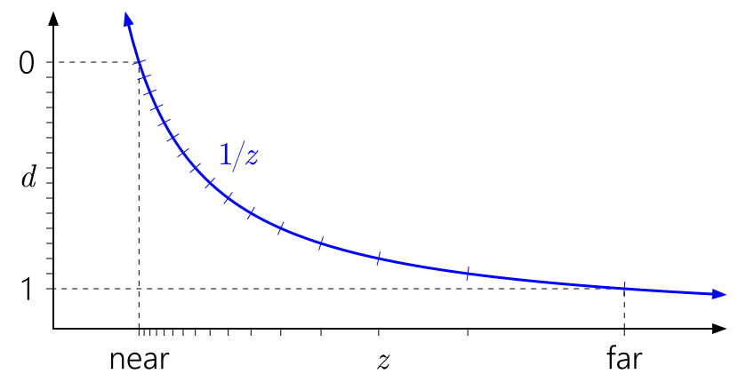{center} -->

  

*距离摄像头越远，深度缓冲区中表示的距离越大，对应的值也越小。—— [NVIDIA 关于深度精度的文章](https://developer.nvidia.com/content/depth-precision-visualized)。*

因为我们关心的是这个深度值相对于水面的深度，所以我们还需要知道水面的深度。`i.screenPosition` 的 `w` 分量很方便地给出了这个值。添加以下代码来获取两个深度值的差值，并输出结果。

~~~HLSL
float depthDifference = existingDepthLinear - i.screenPosition.w;

return depthDifference;
~~~

为了计算水的颜色，我们将使用 `lerp` 函数，该函数接受两个值（在本例中为两个渐变颜色），并基于 0 到 1 范围内的第三个值在这两个值之间进行插值。目前，我们拥有的是世界单位的深度——但我们想知道的是，它与最大深度相比，百分比是多少。我们可以通过将depthDifference除以最大深度来计算这个值。将以下代码插入到声明`depthDifference`的行下方

~~~HLSL
float waterDepthDifference01 = saturate(depthDifference / _DepthMaxDistance);
float4 waterColor = lerp(_DepthGradientShallow, _DepthGradientDeep, waterDepthDifference01);

return waterColor;
~~~

上面的第一行执行了我们刚才讨论过的除法运算。我们还将它传入了 `saturate` 函数——这个函数将值限制在 0 到 1 之间，这正是我们需要的范围。之后，我们将其传入 `lerp` 函数来计算渐变并返回新的水面的颜色。
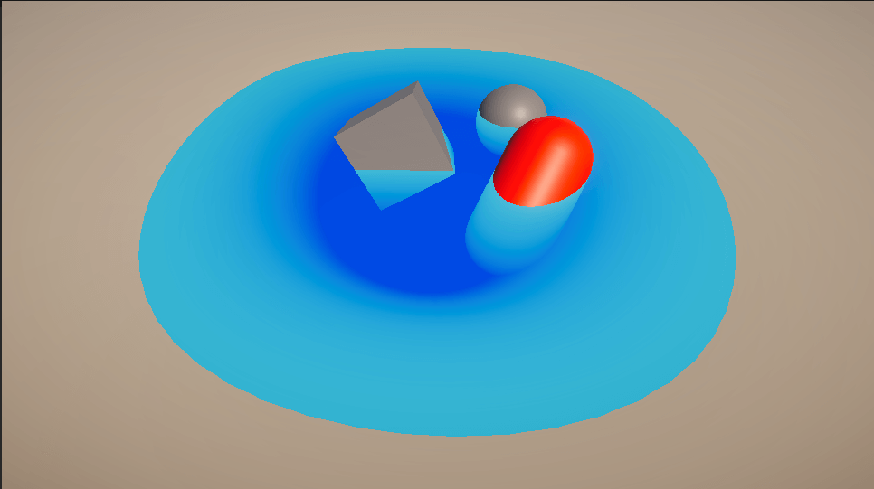

## 2.波浪

接下来，我们将使用噪点纹理在水面添加波浪。同时，我们将利用水深来控制波浪的可见度——这样，我们就能让波浪在浅水区清晰可见，从而营造出海岸线的效果。      

<!-- 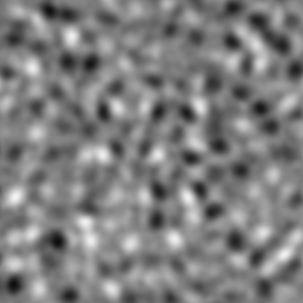 -->

  

### 2.1噪声
为了简单起见，我们使用纹理引入噪声。添加以下代码来设置着色器，使其接收新的纹理属性。
~~~HLSL
// As a new property in Properties.
_SurfaceNoise("Surface Noise", 2D) = "white" {}

…

// Add in the appdata struct.
float4 uv : TEXCOORD0;

…

// Add in the v2f struct.
float2 noiseUV : TEXCOORD0;

…

// Above the vertex shader.
sampler2D _SurfaceNoise;
float4 _SurfaceNoise_ST;

…

// Inside the vertex shader.
o.noiseUV = TRANSFORM_TEX(v.uv, _SurfaceNoise);
~~~

我们在着色器中声明了一个新的纹理属性及其对应的 sampler2D 变量。紧接着在 sampler2D 变量下方声明了另一个 float4 变量——Unity 会自动将与同名纹理关联的平铺和偏移数据填充到此值中。最后，在 appdata 中声明 UV 数据，并将其通过 v2f 结构体从顶点着色器传递到片段着色器。

在 Unity 编辑器中，将 PerlinNoise 赋值到 Surface Noise 插槽，并依照喜好设置参数。回到着色器，我们将采样噪声纹理并将其与表面颜色相结合以渲染波浪。在片段着色器的末尾添加以下内容。

~~~HLSL
float surfaceNoiseSample = tex2D(_SurfaceNoise, i.noiseUV).r;

return waterColor + surfaceNoiseSample;
~~~

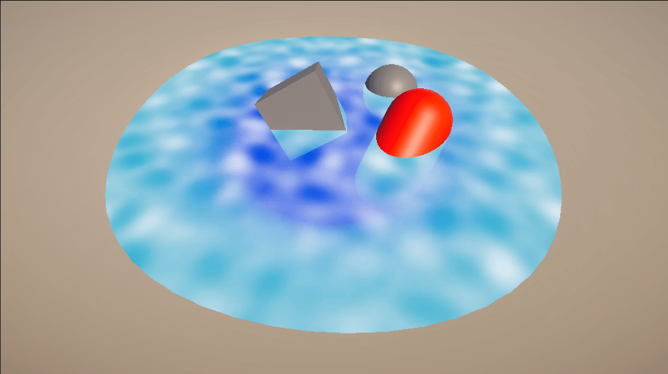

这有点像波浪，像几十年前的水面hhh，我们将应用一个阈值来进行二值化，超过阈值就是白色的，否则就是透明的。

~~~HLSL
// Add as a new property.
_SurfaceNoiseCutoff("Surface Noise Cutoff", Range(0, 1)) = 0.777

…

// Matching property variable.
float _SurfaceNoiseCutoff;

…

// Add in the fragment shader, just after sampling the noise texture.
float surfaceNoise = surfaceNoiseSample > _SurfaceNoiseCutoff ? 1 : 0;

return waterColor + surfaceNoise;
~~~
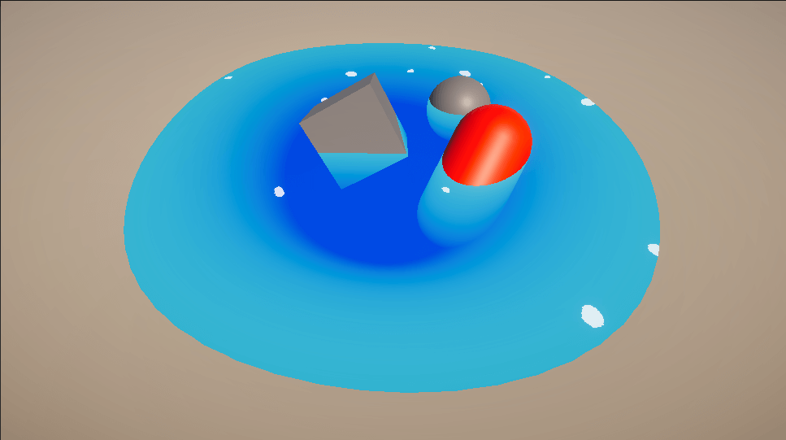

### 2.2边缘泡沫

我们希望在物体和海岸线周围产生泡沫，所以这里我们根据水深调节噪声截止阈值来实现此效果。

~~~HLSL
// Control for what depth the shoreline is visible.
_FoamDistance("Foam Distance", Float) = 0.4

…

// Matching variable.
float _FoamDistance;

…

// Add in the fragment shader, above the existing surfaceNoise declaration.
float foamDepthDifference01 = saturate(depthDifference / _FoamDistance);
float surfaceNoiseCutoff = foamDepthDifference01 * _SurfaceNoiseCutoff;

float surfaceNoise = surfaceNoiseSample > surfaceNoiseCutoff ? 1 : 0;
~~~

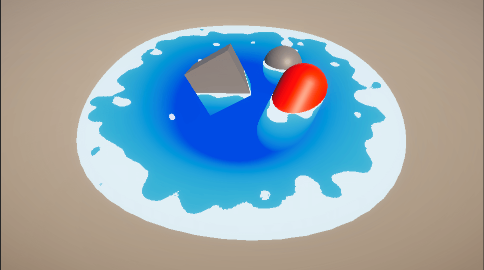

<!-- 泡沫在海岸线附近看起来很好，但在物体交叉点周围却很薄；我们稍后会解决这个问题。 -->

### 2.3泡沫动画

静态水面效果并不怎么有趣——让我们给水波添加一些动感和扭曲效果，首先从动感开始。我们将通过偏移用于采样噪点纹理的UV来实现这一点。
~~~HLSL
// Property to control scroll speed, in UVs per second.
_SurfaceNoiseScroll("Surface Noise Scroll Amount", Vector) = (0.03, 0.03, 0, 0)

…

float2 _SurfaceNoiseScroll;

…

// Add in the fragment shader, above the existing surfaceNoiseSample line.
float2 noiseUV = float2(i.noiseUV.x + _Time.y * _SurfaceNoiseScroll.x, i.noiseUV.y + _Time.y * _SurfaceNoiseScroll.y);
float surfaceNoiseSample = tex2D(_SurfaceNoise, noiseUV).r;
~~~

现在，滚动的感觉就像一张纸在表面上被拉动一样。我们将使用扭曲纹理来增加更多动感。此扭曲纹理类似于法线贴图，只是它只有两个通道（红色和绿色），而不是三个。

  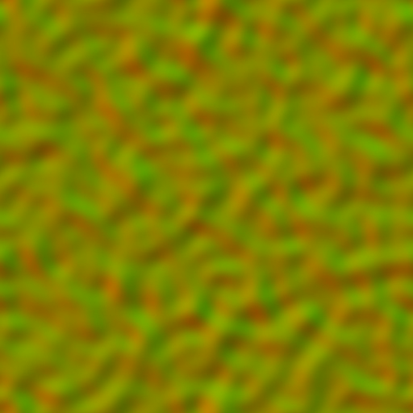

我们将这两个通道解释为二维平面上的向量，并使用它们来拉动噪声纹理的 UV。
~~~HLSL
// Two channel distortion texture.
_SurfaceDistortion("Surface Distortion", 2D) = "white" {}	
// Control to multiply the strength of the distortion.
_SurfaceDistortionAmount("Surface Distortion Amount", Range(0, 1)) = 0.27

…

// Matching variables.
sampler2D _SurfaceDistortion;
float4 _SurfaceDistortion_ST;

float _SurfaceDistortionAmount;

…

// New data in v2f.
float2 distortUV : TEXCOORD1;

…

// Add to the vertex shader.
o.distortUV = TRANSFORM_TEX(v.uv, _SurfaceDistortion);

…

// Add the fragment shader, just above the current noiseUV declaration line.
float2 distortSample = (tex2D(_SurfaceDistortion, i.distortUV).xy * 2 - 1) * _SurfaceDistortionAmount;

float2 noiseUV = float2((i.noiseUV.x + _Time.y * _SurfaceNoiseScroll.x) + distortSample.x, (i.noiseUV.y + _Time.y * _SurfaceNoiseScroll.y) + distortSample.y);
~~~

我们声明新的纹理属性，并像往常一样添加新的 UV 集。在片段着色器中，我们对扭曲纹理进行采样——但在将其添加到 noiseUV 之前，我们将其乘以 2 并减去 1；作为纹理，x 和 y 值（分别为红色和绿色）在 0...1 范围内。然而，作为二维向量，我们希望它在 -1...1 范围内。上面的算法执行了此操作。

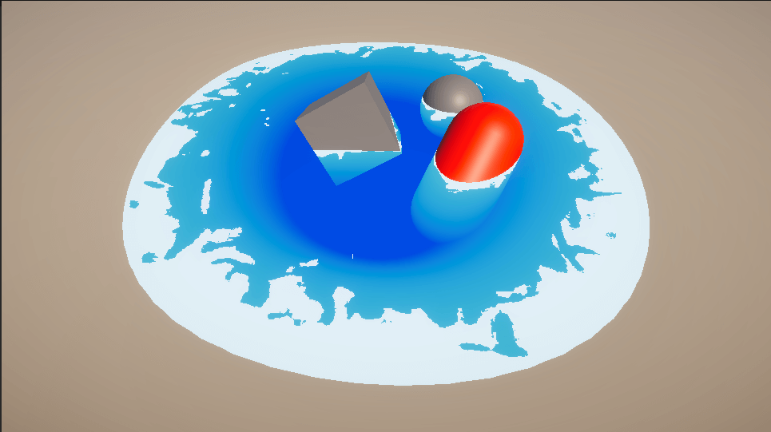

## 3.泡沫修正

目前，海岸线附近的泡沫看起来不错，但在漂浮物体的边缘几乎看不见。这是因为海岸和水之间的深度很小，而水和水下物体之间的深度（从相机视角来看）相对较大。将 _FoamDistance 增加到 0.4 左右可以解决这个问题，但会使海岸线变得非常大。

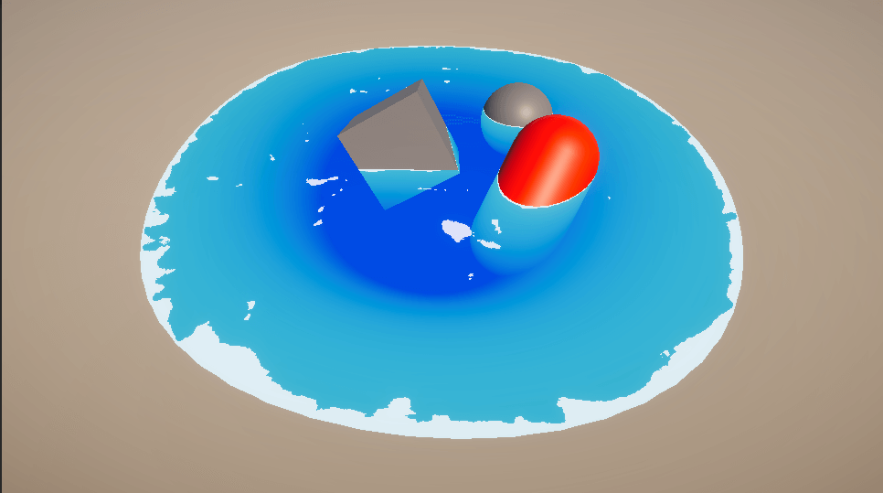

相反，我们将创建一个解决方案，根据水下表面的角度来改变泡沫渲染的深度。这样，几乎垂直的表面（例如岩石）可以比非常平坦的物体（例如海岸线）渲染更深的泡沫。理想情况下，通过像这样调节泡沫量，最终图像中的泡沫在视觉上会保持一致。

### 3.1渲染法线缓冲区

我们的目标是根据水面法线与其间的物体法线之间的角度来调整泡沫的深度值（着色器中的 _FoamDistance）。为此，我们需要访问法线缓冲区。

与深度缓冲区类似，这将是一个可在着色器中使用的屏幕大小的纹理。但是，它存储的不是每个像素的深度，而是法线。

Unity 内置了使用 DepthNormals 深度纹理模式渲染法线缓冲区的功能。这会将深度缓冲区和法线缓冲区打包成一个纹理（每个缓冲区两个通道）。遗憾的是，这会导致深度缓冲区的精度不足以满足我们的需求；因此，我们需要手动将法线渲染到单独的纹理中。初始项目已包含一个用于执行此操作的 C# 脚本，NormalsReplacementShader.cs。

此脚本会创建一个与主摄像机位置和旋转相同的摄像机，但它使用替换着色器 (Replacement Shader) 渲染场景。此外，它不会将场景渲染到屏幕上，而是将输出存储到名为 _CameraNormalsTexture 的全局着色器纹理中。此纹理与我们上面使用的 _CameraDepthTexture 一样，可供所有着色器使用。

将此脚本应用于场景中的 Camera 对象。同时，将 HiddenNormalsTexture 着色器（位于 Shaders 文件夹中）拖到 Normals 着色器插槽中。这个着色器相当简单；它输出对象的视图空间法线。视图空间法线是对象相对于相机视图的法线。

如果您现在运行场景，您会看到一个新的相机，即“法线相机”，作为主相机的子相机自动生成。如果您选择此对象，您可以在相机预览中看到正在渲染的法线。或者，双击相机“目标”纹理槽中的纹理以查看更大的预览。

### 3.2比较视图空间法线

我们需要计算水面的视图空间法线，然后才能将其与渲染到纹理上的法线进行比较。我们可以在顶点着色器中执行此操作，然后将其传递给片段着色器。

~~~HLSL
// Add to appdata.
float3 normal : NORMAL;

…

// Add to v2f.
float3 viewNormal : NORMAL;

…

// Add to the vertex shader.
o.viewNormal = COMPUTE_VIEW_NORMAL;
~~~

有了片段着色器中可用的视图法线，我们可以将其与水面下物体的法线进行比较。我们将以采样深度缓冲区的方式对法线缓冲区进行采样。
~~~HLSL
// As this refers to a global shader variable, it does not get declared in the Properties.
sampler2D _CameraNormalsTexture;

…

// Add to the fragment shader, just above the existing foamDepthDifference01 line.
float3 existingNormal = tex2Dproj(_CameraNormalsTexture, UNITY_PROJ_COORD(i.screenPosition));
~~~

现在，我们已经获得了水面及其后方物体的视图法线。我们将使用点积来比较两者。

点积函数接受两个向量（任意长度）并返回一个数值。当两个向量同向平行且为单位向量（长度为 1 的向量）时，该数值为 1。当两个向量垂直时，该数值为 0。当你将向量从平行方向移向垂直方向时，点积结果将非线性地从 1 变为 0。请注意，当两个向量之间的夹角大于 90 度时，点积结果为负数。

~~~HLSL
// Add to the fragment shader, below the line sampling the normals texture.
float3 normalDot = saturate(dot(existingNormal, i.viewNormal));
~~~

我们将使用点积的结果来控制泡沫量。当点积较大（接近 1）时，我们将使用比点积较小（接近 0）时更低的泡沫阈值。

~~~HLSL
// Replace the _FoamDistance property with the following two properties.
_FoamMaxDistance("Foam Maximum Distance", Float) = 0.4
_FoamMinDistance("Foam Minimum Distance", Float) = 0.04

…

// Replace the _FoamDistance variable with the following two variables.
float _FoamMaxDistance;
float _FoamMinDistance;

…

// Add to the fragment shader, above the existing foamDepthDifference01 line.
float foamDistance = lerp(_FoamMaxDistance, _FoamMinDistance, normalDot);
float foamDepthDifference01 = saturate(depthDifference / foamDistance);
~~~

通过饱和点积结果，我们得到了 0...1 范围内的值，从而可以轻松传递到 lerp 函数，就像我们插入水的颜色一样。

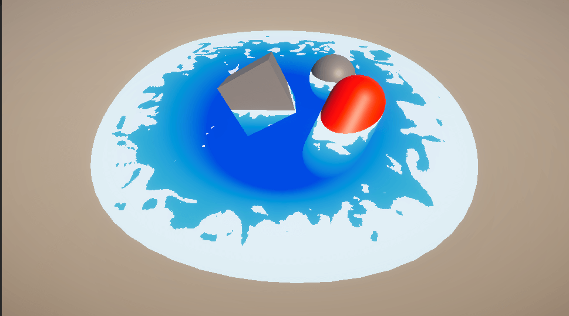
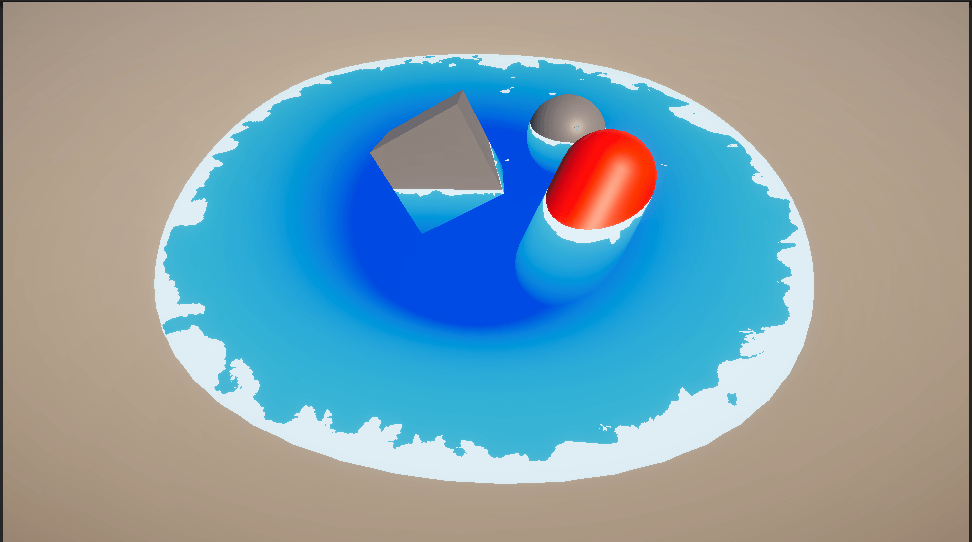

## 4.水体透明

现在，水是完全不透明的。虽然按深度着色确实能营造出透明的视觉效果，但沙子的纹理却完全没有透过水面显现出来。对于某些场景来说，这或许是理想的选择——如果你正在模拟海水，那么将其渲染成不透明是合理的，因为海水的深度很大，所以往往会呈现出不透明的效果。然而，对于我们的小池塘场景，我们将添加一些透明度来反映水的浅浅性质。

~~~
// Add just inside the SubShader, below its opening curly brace.
Tags
{
	"Queue" = "Transparent"
}
~~~

这告诉 Unity 在“Geometry”队列中的所有对象都渲染完成后，使用此着色器渲染对象；这个队列通常是绘制不透明对象的地方。这样，我们就可以将透明水覆盖在所有不透明对象之上，并将它们混合在一起。可以在[此处](https://docs.unity3d.com/Manual/SL-SubShaderTags.html)阅读有关渲染顺序和队列的更多信息。
~~~
// Add inside the Pass, just above the CGPROGRAM's start.
Blend SrcAlpha OneMinusSrcAlpha
ZWrite Off
~~~
混合这一行决定了混合的发生方式。我们使用一种通常被称为普通混合的算法，类似于 Photoshop 等软件混合两层的方式。

之后，我们关闭 ZWrite。这会阻止我们的对象被写入深度缓冲区；如果对象被写入深度缓冲区，它将完全遮挡其后方的对象，而不是仅部分遮挡它们。
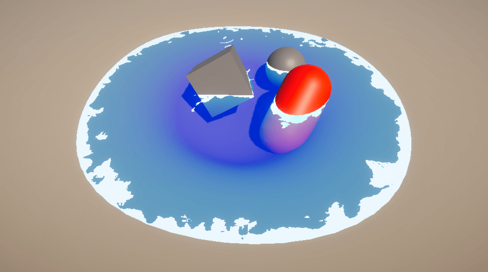

## 5.颜色修正
我们的水几乎与最终图像一致。接下来，我们将添加一个新属性来控制水泡沫的颜色。虽然白色在这个场景中看起来很棒，但不同类型的表面可能需要不同颜色的泡沫。

~~~
_FoamColor("Foam Color", Color) = (1,1,1,1)

…

float4 _FoamColor;

…

// Add inside the fragment shader, just below the line declaring surfaceNoise.
float4 surfaceNoiseColor = _FoamColor * surfaceNoise;

return waterColor + surfaceNoiseColor;
~~~

这允许我们修改泡沫的颜色，但如果你在场景中使用 _FoamColor 变量，你会发现它会产生混合效果。红色泡沫变成了粉红色，而全黑泡沫只会在原处留下浅蓝色的高光。这是因为我们对用于生成最终值的两种颜色进行了加法混合。

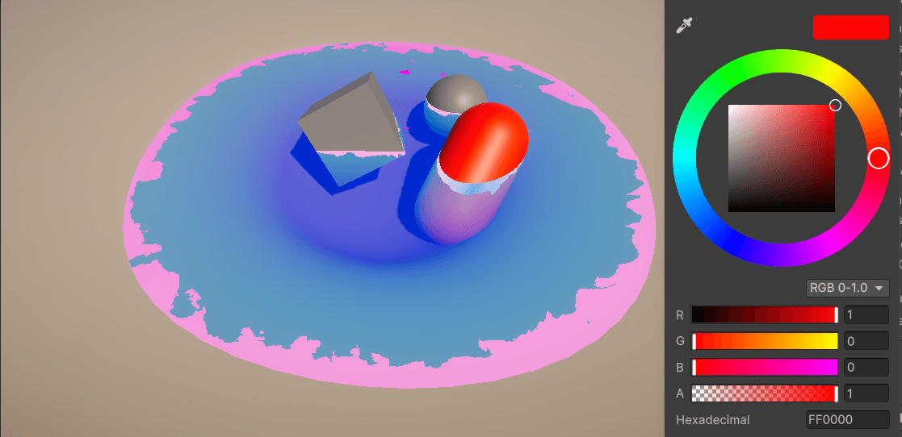

顾名思义，加法混合是将两种颜色相加，从而产生更明亮的效果。这对于发光的物体（例如火花、爆炸或闪电）非常有用。我们希望将泡沫与水面混合——它们都不发光，因此结果不应该更亮；加法混合并不适合此任务。

我们将使用 Unity 用于将着色器与背景混合的相同算法来混合这两种颜色，我们上面称之为普通混合。如果我们重新回顾下面这行代码，就可以了解这种混合的工作原理。

~~~
Blend SrcAlpha OneMinusSrcAlpha
~~~

Blend 函数在提供两个参数时，其工作原理是：将着色器的输出乘以第一个值（SrcAlpha，即着色器输出的 Alpha 值），将屏幕颜色乘以第二个值（OneMinusSrcAlpha，即 1 - 输出的 Alpha 值），然后将两者相加得到最终颜色。Unity 的这篇文章对此进行了更详细的解释。

我们将在 CGPROGRAM 中将其复制为一个函数。在 appdata 声明上方添加以下内容。
~~~
float4 alphaBlend(float4 top, float4 bottom)
{
	float3 color = (top.rgb * top.a) + (bottom.rgb * (1 - top.a));
	float alpha = top.a + bottom.a * (1 - top.a);

	return float4(color, alpha);
}
~~~

第一行执行上面描述的混合操作。因为我们希望最终输出保持透明度，所以我们也对颜色的 Alpha 通道执行了混合。我们将使用此函数来混合最终输出。
~~~
// Place in the fragment shader, replacing the code in its place.
float4 surfaceNoiseColor = _FoamColor;
surfaceNoiseColor.a *= surfaceNoise;

return alphaBlend(surfaceNoiseColor, waterColor);
~~~

请注意，我们现在仅乘以泡沫的 alpha，而不是整个颜色。

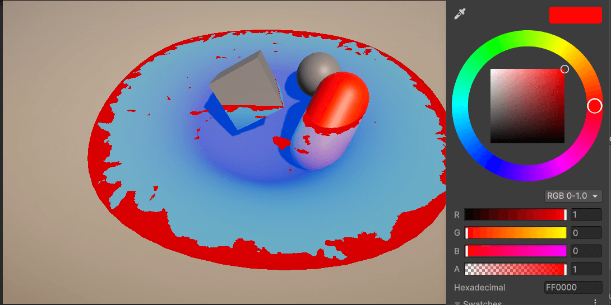

## 6.泡沫抗锯齿

在完成着色器之前，我们将进行最后一次改进。如果仔细观察泡沫，会发现边缘相当参差不齐。这是因为我们对噪点纹理进行了二元截断处理；每个像素要么拥有完整的 Alpha 值，要么完全没有。因此，我们将使用 SmoothStep 函数将 Alpha 值从 0 平滑地混合到 1。

<!-- 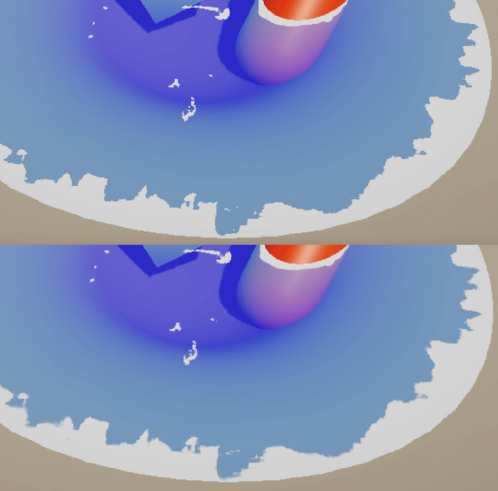 -->

  

Smoothstep 与 lerp 有点类似。它接受三个值：一个下限、一个上限以及一个预期介于这两个上限之间的值。Smoothstep 根据第三个值在上下限之间的距离返回一个介于 0 到 1 之间的值。（如果第三个值超出了下限或上限，则 Smoothstep 分别返回 0 或 1）。

  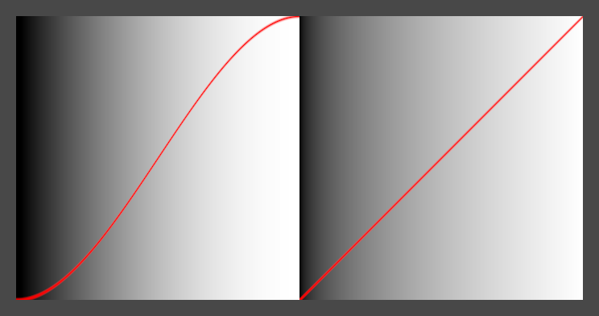

与 lerp 不同，smoothstep 不是线性的：当值从 0 到 0.5 时，它会加速；当值从 0.5 到 1 时，它会减速。这使得它非常适合平滑地混合值，这也是我们下面要用到的方法。

~~~
// Insert just after the CGPROGRAM begins.
#define SMOOTHSTEP_AA 0.01

…

float surfaceNoise = smoothstep(surfaceNoiseCutoff - SMOOTHSTEP_AA, surfaceNoiseCutoff + SMOOTHSTEP_AA, surfaceNoiseSample);
~~~

我们定义的上下限（函数的前两个参数）非常接近——它们之间的距离刚好足够为边缘添加一些平滑度。当 surfaceNoiseSample 超出这些界限时，它会像之前一样返回 0 或 1。

## 7.结尾

然后我们就得到了以下的结果

完整代码：

~~~HLSL
Shader "Unlit/ToonWater"
{
    Properties
    {
        // ---------- 水体颜色相关 ----------
        _DepthGradientShallow("Depth Gradient Shallow", Color) = (0.3, 0.875, 0.9, 0.75) // 浅水颜色
        _DepthGradientDeep("Depth Gradient Deep", Color) = (0, 0.3, 1, 0.75)             // 深水颜色
        _DepthMaxDistance("Depth Maximum Distance", Float) = 1                           // 水深和颜色映射的最大距离

        // ---------- 水面波纹噪声 ----------
        _SurfaceNoise("Surface Noise", 2D) = "white" {}                                  // 水面噪声纹理
        _SurfaceNoiseCutoff("Surface Noise Cutoff", Range(0, 1)) = 0.7                   // 噪声阈值（控制水面泡沫出现多少）
        _SurfaceNoiseScroll("Surface Noise Scroll Amount", Vector) = (0.03, 0.03, 0, 0) // 噪声滚动速度（让水面流动）
        _SurfaceDistortion("Surface Distortion", 2D) = "white" {}                        // 扭曲贴图
        _SurfaceDistortionAmount("Surface Distortion Amount", Range(0, 1)) = 0.25        // 扭曲强度

        // ---------- 泡沫相关 ----------
        _MaxFoamDistance("Maximum Foam Distance", Float) = 0.4                           // 泡沫最大出现距离（近岸/浅水）
        _MinFoamDistance("Minimum Foam Distance", Float) = 0.04                          // 泡沫最小出现距离（深水）
        _FoamColor("Foam Color", Color) = (1,1,1,1)                                      // 泡沫颜色
    }
    SubShader
    {
        Tags { "Queue"="Transparent" }   // 标记为透明物体
        LOD 100
        Blend SrcAlpha OneMinusSrcAlpha       // 使用半透明混合
        ZWrite Off                            // 关闭深度写入（保证透明效果）

        Pass
        {
            CGPROGRAM
            #pragma vertex vert
            #pragma fragment frag

            #include "UnityCG.cginc"

            #define SMOOTHSTEP_AA 0.01 // 平滑边缘用的小偏移量（抗锯齿）

            float4 _DepthGradientShallow;
            float4 _DepthGradientDeep;
            float _DepthMaxDistance;

            sampler2D _CameraDepthTexture;   // 相机深度图
            sampler2D _CameraNormalsTexture; // 相机法线图

            sampler2D _SurfaceNoise;
            float4 _SurfaceNoise_ST;
            float _SurfaceNoiseCutoff;
            float2 _SurfaceNoiseScroll;

            sampler2D _SurfaceDistortion;
            float4 _SurfaceDistortion_ST;
            float _SurfaceDistortionAmount;

            float _MaxFoamDistance;
            float _MinFoamDistance;
            float4 _FoamColor;

            // 透明度混合函数：将顶层和底层颜色按 alpha 混合
            float4 alphaBlend(float4 top, float4 bottom)
            {
                float3 color = (top.rgb * top.a) + (bottom.rgb * (1 - top.a));
                float alpha = top.a + bottom.a * (1 - top.a);

                return float4(color, alpha);
            }

            struct appdata
            {
                float4 vertex : POSITION;   // 顶点位置
                float4 uv : TEXCOORD0;      // UV 坐标
                float3 normal : NORMAL;     // 顶点法线
            };

            struct v2f
            {
                float4 vertex : SV_POSITION;     // 裁剪空间位置
                float4 screenPosition : TEXCOORD2; // 屏幕坐标（用于深度采样）
                float2 noiseUV : TEXCOORD0;      // 水面噪声 UV
                float2 distortUV : TEXCOORD1;    // 扭曲贴图 UV
                float3 viewNormal : NORMAL;      // 视角空间下的法线
            };

            v2f vert (appdata v)
            {
                v2f o;
                o.vertex = UnityObjectToClipPos(v.vertex); // 转换到裁剪空间
                o.screenPosition = ComputeScreenPos(o.vertex); // 计算屏幕空间坐标

                // 处理 UV（支持纹理平铺与偏移）
                o.noiseUV = TRANSFORM_TEX(v.uv, _SurfaceNoise);
                o.distortUV = TRANSFORM_TEX(v.uv, _SurfaceDistortion);

                // 视角空间法线（用于与场景法线对比）
                o.viewNormal = COMPUTE_VIEW_NORMAL;
                return o;
            }

            fixed4 frag (v2f i) : SV_Target
            {
                // ========== 1. 水体颜色（根据深度插值） ==========
                float existingDepth01 = tex2Dproj(_CameraDepthTexture, UNITY_PROJ_COORD(i.screenPosition)).r; // 取深度图
                float existingDepthLinear = LinearEyeDepth(existingDepth01); // 转换为线性深度
                float depthDifference = existingDepthLinear - i.screenPosition.w; // 水面到场景物体的深度差
                float waterDepthDifference01 = saturate(depthDifference / _DepthMaxDistance); // 映射到 [0,1]
                float4 waterColor = lerp(_DepthGradientShallow, _DepthGradientDeep, waterDepthDifference01); // 浅水到深水颜色插值

                // ========== 2. 水面扭曲与流动 ==========
                float2 distortSample = (tex2D(_SurfaceDistortion, i.distortUV).xy * 2 - 1) * _SurfaceDistortionAmount; // 扭曲偏移
                float2 noiseUV = float2(
                    (i.noiseUV.x + _Time.y * _SurfaceNoiseScroll.x) + distortSample.x,
                    (i.noiseUV.y + _Time.y * _SurfaceNoiseScroll.y) + distortSample.y
                ); // 噪声 UV + 时间滚动 + 扭曲
                float surfaceNoiseSample = tex2D(_SurfaceNoise, noiseUV).r; // 水面噪声采样

                // ========== 3. 泡沫（依赖法线与深度） ==========
                float3 existingNormal = tex2Dproj(_CameraNormalsTexture, UNITY_PROJ_COORD(i.screenPosition)); // 场景法线
                float3 normalDot = saturate(dot(existingNormal, i.viewNormal)); // 与水面法线的夹角（越小越容易有泡沫）

                float foamDistance = lerp(_MaxFoamDistance, _MinFoamDistance, normalDot); // 泡沫出现的深度阈值
                float foamDepthDifference01 = saturate(depthDifference / foamDistance);   // 根据深度判断泡沫强度
                float surfaceNoiseCutoff = foamDepthDifference01 * _SurfaceNoiseCutoff;  // 控制噪声阈值

                // 通过 smoothstep 得到平滑的噪声边缘
                float surfaceNoise = smoothstep(surfaceNoiseCutoff - SMOOTHSTEP_AA, surfaceNoiseCutoff + SMOOTHSTEP_AA, surfaceNoiseSample);

                // 泡沫颜色（alpha 用噪声控制）
                float4 surfaceNoiseColor = _FoamColor;
                surfaceNoiseColor.a *= surfaceNoise;

                // ========== 4. 混合输出 ==========
                return alphaBlend(surfaceNoiseColor, waterColor);
            }
            ENDCG
        }
    }
}

~~~