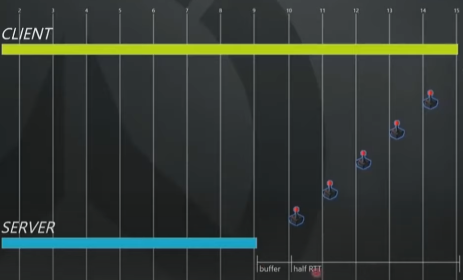
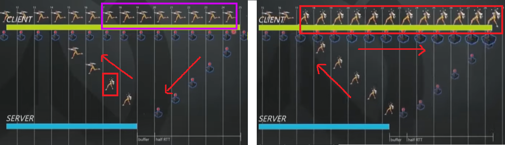

+++
title = "启示录——守望先锋的ECS框架与网络同步"
date = "2023-10-31 10:46:00 +0800"
tags = ["Game Design", "Tech"]
slug = "Revelation - Overwatch's ECS framework and network synchronization"
indent = false
dropCap = false
# katex = true
+++

> 《守望先锋》采用 ECS架构，打造了丰富多样的游戏玩法，使得其中的每个英雄都在深度上独树一帜而且易于扩展。从托比昂在移动的卡车上建造炮塔，到卢西奥用声波枪攻击敌人，英雄们的技能是独一无二而且复杂的。在2017年的GDC的会议上，暴雪的 Timothy Ford 揭秘了《守望先锋》所使用的游戏技术。

## ECS架构

## 网络同步

### A Big Deal

守望先锋的网络同步
如果你想做一个快速反应，对网络同步要求很高的游戏，例如FPS(Overwatch/CS等)、Moba(Lol/Dota)等类型，如果你必须等待服务器告诉你发生了什么，那么玩家将感受到任何东西都不会有及时的响应能力。想象一下那些高Ping的情况，你的操作总会是延后几百毫秒，这也是20多年来的游戏史上，这种类型游戏必须面对的老大难问题。  

想让游戏具有实时响应能力，一个自然而然地解决思路就是去预测玩家的动作，然而游戏中，玩家交给程序的权限只有玩家的输入，在大多数情况下，玩家的输入都在键鼠和手柄上，玩家也不会允许游戏程序去收集玩家的操作信息从而分析玩家的操作习惯(法律应该也不允许未经同意搜集玩家的隐私数据)，所有的一切都只能靠玩家的输入操作。  

网络同步的其中一个目标就是，让游戏中的一切都能迅速响应，快速移动、施放法术、武器投射物等，玩家按下按钮，玩家就会看到立即响应，即便是在高延迟的情况下，玩家也该立刻看到响应。 

### 网络同步的副作用
  
网络同步的副作用是服务器权限以及滞后带来的。你以为你已经进行的操作，其实在服务器端并没有发生。服务器会尝试纠正客户端，不过这是在以不牺牲响应速度为前提的条件下完成的。这听起来有点绕，但是其实如果你玩网游比较多的话，在网络不太给力的时候，还是会经常遇到的。

 > *比如敌人对你释放了一个缓速并冻结的技能，你正在被缓速，这时候你使用了一个位移技能准备逃离敌人的技能范围，在你的屏幕上会发生以下的事情：*  
    *1. 你的位移技能生效了，你闪出了敌人的缓速冻结的技能范围，你的位移技能释放后进入了冷却CD*  
    *2. 几十或者上百毫秒之后，你突然好像时光回溯一样，你回到了之前的位置，敌人正在向你释放缓速冻结技能，只不过这一次的版本是你并没有及时地按下闪避技能，而且你发现你的闪避技能也恢复到了释放之前的Ready状态*

其实这里的第一个过程是没有同步到服务器的，所以网络同步对你(也就是客户端进行了矫正)，就会发生2中的情况。

当然这里的副作用是很难解决的，在大多数情况下，只要你的网络状态没有很大的波动，这种副作用带来的矫正发生的几率是很小的。不过也正是网络同步使得多人游戏的游玩正确性得到了保障。

### 同步时钟
《守望先锋》的确定性模拟依赖于**同步时钟**，**FixedUpdate**和**量化的命令帧**。客户端和服务器都在同步时钟上运行，并且在一个固定的命令帧中执行。在常规的游戏中，命令帧大概是16ms，在竞技比赛中，命令帧的长度是7ms，其实这相当于60Hz和144Hz的刷新率所对应的时间。

> 最近正好要换一个电脑显示器，看了很多高刷新率的有的刷新率甚至支持高达360Hz的屏幕，那么问题来了：屏幕刷新速度很快，但是网络同步刷新很慢，电竞上面鼓吹的追求极限高刷新率，有用吗？

让我们看一下《守望先锋》的同步时钟是如何做的，下面是同步时钟的演示图：

上面的客户端(黄色部分)不断地产生新的输入指令，这些指令会在很短的时间内传入服务器(下面的蓝色部分)，从图中我们可以看到，客户端永远比服务器快Buffer+Half RTT的时间：  
- Buffer：大约16ms  
- RTT：网络上数据传送的时间和处理的时间，可以认为是Ping的时间延迟+处理的时间。   
  
在Timothy的举例中，RTT的时间大约是160ms，也就是说玩家的操作指令发出后，指令会用80ms传送到服务器，然后再加上16ms的缓冲时间(也就是每更新帧的长度)，也就是说客户端的时间要比服务器的时间快80+16ms。  
请注意，这里的96ms并不是游玩过程中的延迟，而是服务器和客户端之间同步时钟的距离。在游玩过程中你所需要注意的延迟仅仅只是那16ms的更新帧的长度。这也就解释了为什么你在玩一些游戏的时候，游戏的延迟总是会保持在15-16ms，或是更快一些的6-7ms

那么回到刚才的问题：高刷的屏幕到底有用吗，一般游戏的更新帧区间不会小于7ms，也就是144Hz，我的看法是，在当前的环境下，屏幕的刷新率只会影响到你客户端(你的屏幕)所看到的内容的更新速度，也就是一些更加连贯的插值动画，对你的输入操作没有影响。当然这仅限于游戏的同步时钟是FixedUpdate是144Hz的情况，如果其他游戏的同步速率更快，那可能就是另外一种情况了。总的来说是高刷显示器有用，但用处不大，起码对于《守望先锋》来说是用处不大的。  

让我们来看一下网络同步中的错误预判，下图是玩家由跑动指令变为空闲站立指令的转变：

左图中客户端不断地接收用户的run指令，在某一帧指令变成Idle，在服务器接收到idle指令并将idle指令发回客户端之前，客户端的角色状态一直是跑动(左图中紫色部分)，在客户端接收到服务器的idle指令以后，很不幸的是，客户端的角色跑动状态(左图中紫色部分)是错误的预测，那么客户端就会立刻回滚，也就是服务器纠正了客户端的行为，将客户端的角色跑动状态(左图中紫色部分)纠正为右图的Idle状态。这时候就是我在上文提到的**网络同步的副作用**。

### 网络问题

众所周知，网络连接不会一直稳定可靠，有时候网络的不稳定和丢包会导致网络同步出现问题，所以这里要讲一下守望先锋是如何处理这方面的问题的。  

守望先锋使用的是UDP传输，但是暴雪增加了一层自定义的可选项用来将UDP变得更可靠。  

客户端的输入在某些情况下不会传输到服务器，这里暴雪的服务器会尝试保留一个缓冲区，这个缓冲区就是玩家没有输入的区间。这里的缓冲区应当被设计的尽量小，以保持游戏的响应速度，如果服务器耗尽了缓冲区，也就是在缓冲区间仍然没有成功得到玩家的输入的数据报文，那么服务器就只能替玩家“预测”输入指令了，也就是会重复玩家的最后一个输入。当正确的输入指令到达后，服务器会尝试协调这些指令，然后模拟出正确理应发生的内容以纠正自己的错误预测并同步发送给客户端。

这里会发生一个比较难以解释的问题，因为服务器并不总是能正确“预测玩家”的输入，暴雪的服务器有一个很复杂的机制，它可以检测到玩家的输入中断，当服务器收不到玩家的输入指令，客户端会加快帧同步速度，在一般情况下的帧长度大概是16ms(60Hz上文提到的)，这时候客户端会加快帧速率，比如15.2ms,而服务器保持在16ms,这为服务器提供了更大的输入缓冲区，同时也加快了检测玩家输入的帧。这样一举两得的技术对网络游戏中遇到的网络延迟、抖动、丢包提供了一个很好的解决方案。

其实服务器要做的更为复杂和巧妙，我这里只是一言以蔽之，感兴趣的可以参考GDC的开发者大会。

**网络同步中...**  
**文章正在加载...**

