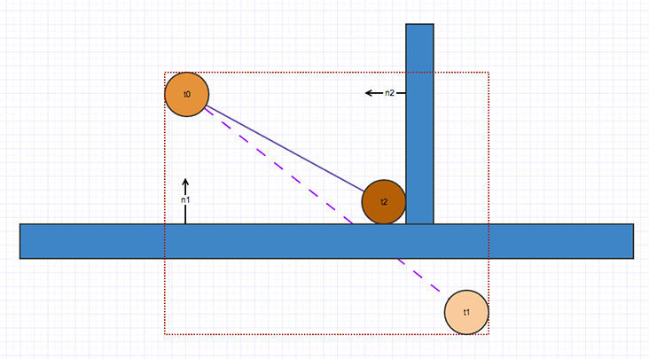
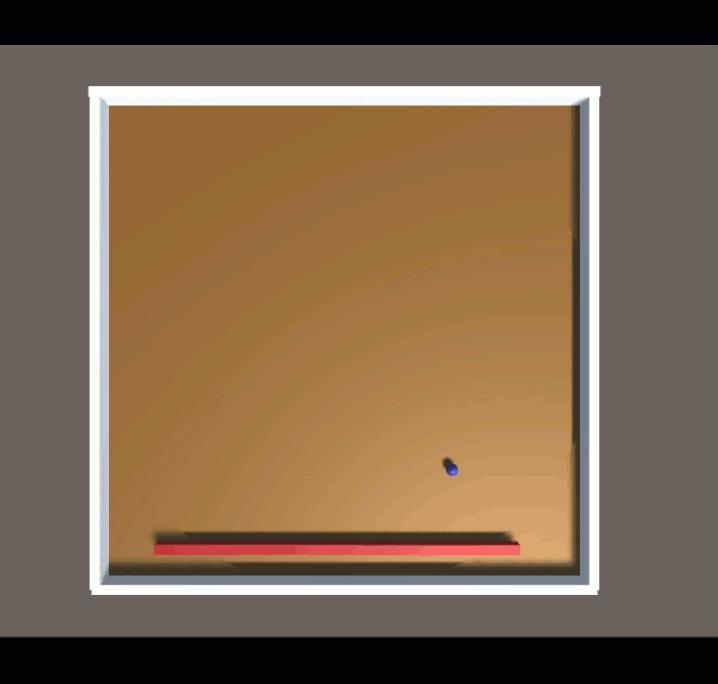

+++
title = "Unity连续碰撞检测"
date = "2023-11-12 14:56:00 +0800"
tags = ["Game Design", "Tech"]
slug = "Unity continuous collision detection"
# indent = false
# dropCap = false
# katex = true
+++

> Unity有两个内置的碰撞检测方案，基于扫掠的CCD和推断性CCD，其实在大部分的项目中，这两种开箱即用的的方法适用于很多情形下的物理模拟了。在你有能力实现自己的物理碰撞系统前，它们无疑是项目最好的选择。

## 连续碰撞检测 (CCD)

看了一些Unity面试的问题，在物理系统中有一个经典的问题就是：如何保证快速运动的物体能够正确的发生碰撞而不是穿透物体。  

有一些Unity开发经验的开发者可能知道这里为什么会出现问题，那就是Unity的物理模拟的帧较长，在每帧更新的时候，因为物体很快，物体在一帧的时间段内的跨度大于被碰撞物体的Collider了。

有一些无良的教程会让开发者减少每帧的时间，也就是修改Fixed Timestep，单纯的增加模拟的检测密度来检测碰撞，这么做的“好处”就是：项目的资源消耗会成倍增加，你可以更快地淘汰并更换自己的电脑硬件~  
那么有什么合理的方法吗：其实有 Hitscan 和 CCD 之类的其他方法，这里我只介绍Unity提供给我们的CCD。

连续碰撞检测(Continuous collision detection)可确保快速移动的物体与物体碰撞。

### 基于扫掠的 CCD
要使用基于扫掠的 CCD，我们在 Inspector 窗口中选择一个刚体 (RigidBody)，并将 Collision Detection 设置为 Continuous 或 Continuous Dynamic 即可。

基于扫掠的 CCD 采用撞击时间 (TOI) 算法，通过扫掠对象的前向轨迹来计算对象的潜在碰撞（采用对象的当前速度）。如果沿对象移动方向有接触，该算法会计算撞击时间并移动对象直至达到该时间。代价是需要经历更多的 CPU 周期。

然而，因为此方法依赖于线性扫掠，所以会忽略物体的角运动。例如，弹球机上的弹球杆固定在一端，围绕一个固定点旋转。弹球杆只做角运动，不做线性运动，因此无法正确撞击小球：  

已启用 Continuous Dynamic 属性的细杆游戏对象。绕轴心点快速旋转时，此杆不会与球体接触。

基于扫掠的 CCD 的另一个问题是性能问题。如果附近有大量启用 CCD 的高速对象，CCD 的开销将由于进行额外的扫掠而很快增加，因此物理引擎不得不执行更多的 CCD 子步骤。

### 推断性 CCD
要使用推断性 CCD，将 Collision Detection 设置为 Continuous Speculative 即可。

推断性 CCD 的工作原理是基于对象的线性运动和角运动增大一个对象的粗筛阶段轴对齐最小包围盒 (AABB)。该算法是一种推测性的算法，因为会选取下一物理步骤中的所有潜在触点。然后将所有触点送入解算器，因此可确保满足所有的触点约束，使对象不会穿过任何碰撞体。

此算法选择所有在下一个物理步骤中潜在的接触点。所有接触点都会被注入到solver中，以确保所有的接触约束都能得到满足，这样物体就不会在碰撞期间引起隧道效应了。  
下图显示了一个从t0移动的球，如果它运动路线上没有墙的话，会移动到 t1。通过将它当前位置扩展为AABB，预测算法获得n1和n2两条法线。算法告诉solver预测这些接触点，以使球不会穿过墙面。

从t0移动的球，如果它运动路线上没有墙的话，会移动到 t1。通过将它当前位置扩展为AABB，预测算法获得n1和n2两条法线。算法告诉solver预测这些接触点，以使球不会穿过墙面。

已启用 Continuous Dynamic 属性的细杆游戏对象。绕轴心点快速旋转时，此杆不会与球体接触。

但是，推测性 CCD 可能会导致幽灵碰撞；在这种碰撞中，对象的运动受到推测性触点的影响，而这是不应发生的。这是因为推测性 CCD 根据最近点算法收集所有潜在触点，所以触点法线不太准确。这通常会使高速对象沿着细分的碰撞特征滑动并跳起来，但不应该这样。例如，下图中，球体从 t0 开始向右水平移动，积分后的预测位置为 t1。扩大后的 AABB 与框形 b0 和 b1 重叠，而 CCD 在 c0 和 c1 产生两个推测性触点。由于推测性 CCD 使用最近点算法来生成触点，__c0__ 具有非常倾斜的法线，因此解算器会将其视作斜坡。

解算器认为 c0 处的触点是斜坡，因为最近点算法生成了不准确的触点法线。

这种非常倾斜的法线导致 t1 在积分后向上跳动，而不是笔直向前移动。

在 c0 处产生的幽灵碰撞导致球体错误地向上跳跃，而不是笔直向前移动

推测性 CCD 还可能导致发生穿隧，因为只会在碰撞检测阶段计算推测性触点。在触点求解过程中，如果一个对象从解算器获得太多能量，在积分后，其最终位置可能在初始扩大的 AABB 之外。如果在紧邻 AABB 的外部发生碰撞，对象会从右边穿出。

例如，下图显示了球体从 t0 向左移动，而球杆顺时针旋转。如果球体从撞击中获得太多能量，最终可能离开扩大的 AABB（红点矩形），落在 t1 处。如果在紧邻 AABB 的外部发生碰撞（如下面的蓝色框所示），球体最终可能会从右边穿出。这是因为解算器只计算扩大的 AABB 的内部触点，在求解和积分阶段不会执行碰撞检测。

